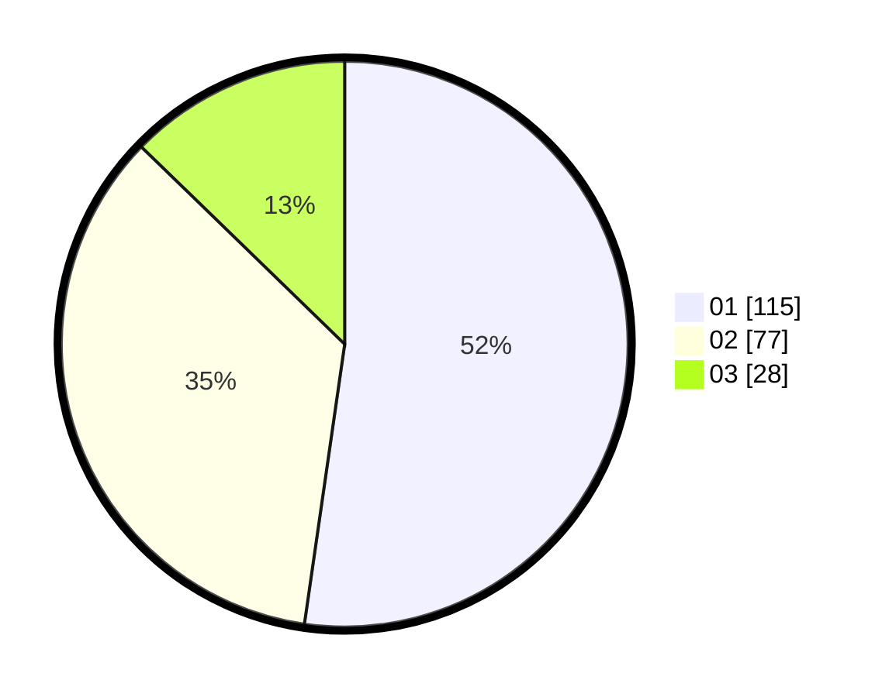

# Hasil

Hasil perolehan suara paslon dapat dilihat pada file paslon-01.txt, paslon-02.txt, dan paslon-03.txt.

Jika tidak ada, artinya data tersebut belum ada pada SIREKAP.

## Perolehan Suara

 * Paslon 01: **115**.
 * Paslon 02: **77**.
 * Paslon 03: **28**.

## Foto C Plano

https://sirekap-obj-formc.kpu.go.id/f6a7/pemilu/ppwp/31/75/04/10/05/3175041005097-20240216-174648--8f895c7a-f8a1-475d-97e7-0b04dc4c2e29.jpg

https://sirekap-obj-formc.kpu.go.id/f6a7/pemilu/ppwp/31/75/04/10/05/3175041005097-20240216-174445--074c6678-dca9-4247-9f57-45822f115a14.jpg

https://sirekap-obj-formc.kpu.go.id/f6a7/pemilu/ppwp/31/75/04/10/05/3175041005097-20240216-174548--b86b2836-c9f9-4d9f-b48e-72b35bfa012f.jpg
