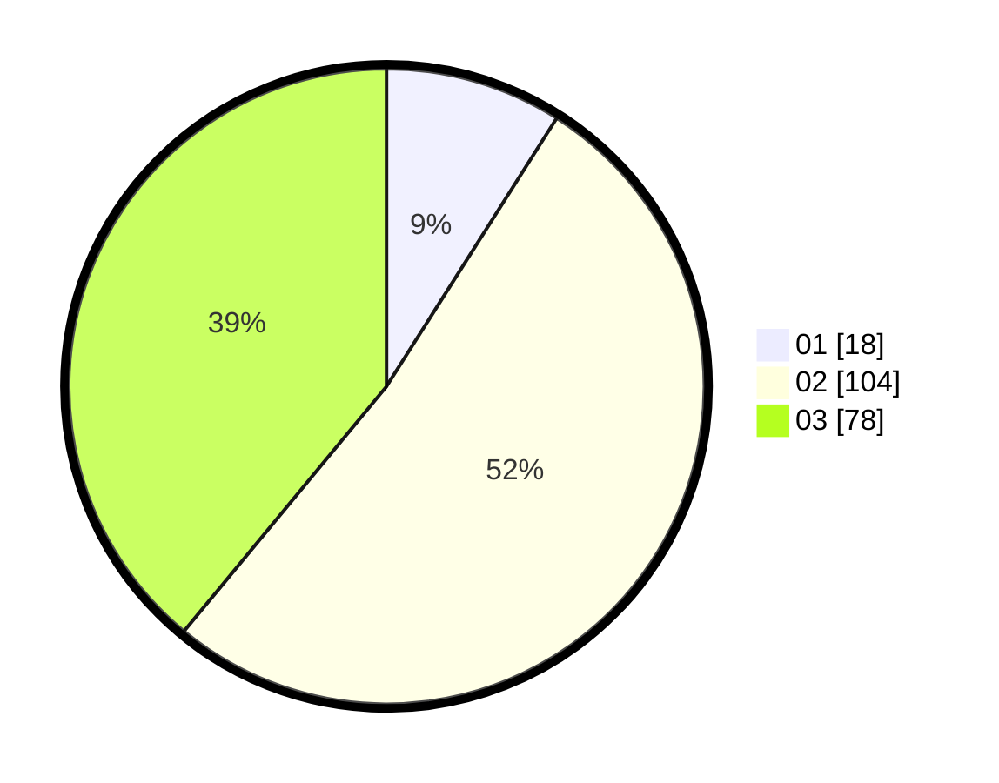

# Hasil

Hasil perolehan suara paslon dapat dilihat pada file paslon-01.txt, paslon-02.txt, dan paslon-03.txt.

Jika tidak ada, artinya data tersebut belum ada pada SIREKAP.

## Perolehan Suara

 * Paslon 01: **18**.
 * Paslon 02: **104**.
 * Paslon 03: **78**.

## Foto C Plano

https://sirekap-obj-formc.kpu.go.id/62d8/pemilu/ppwp/31/75/04/10/06/3175041006006-20240214-205941--11e27a1c-b551-4210-bb0f-a8ac822cb773.jpg

https://sirekap-obj-formc.kpu.go.id/62d8/pemilu/ppwp/31/75/04/10/06/3175041006006-20240216-162146--db8f7c4b-0398-4007-a219-b0b85932fcfe.jpg

https://sirekap-obj-formc.kpu.go.id/62d8/pemilu/ppwp/31/75/04/10/06/3175041006006-20240216-162326--d005104e-8a94-40da-ba94-2bb23499747f.jpg
