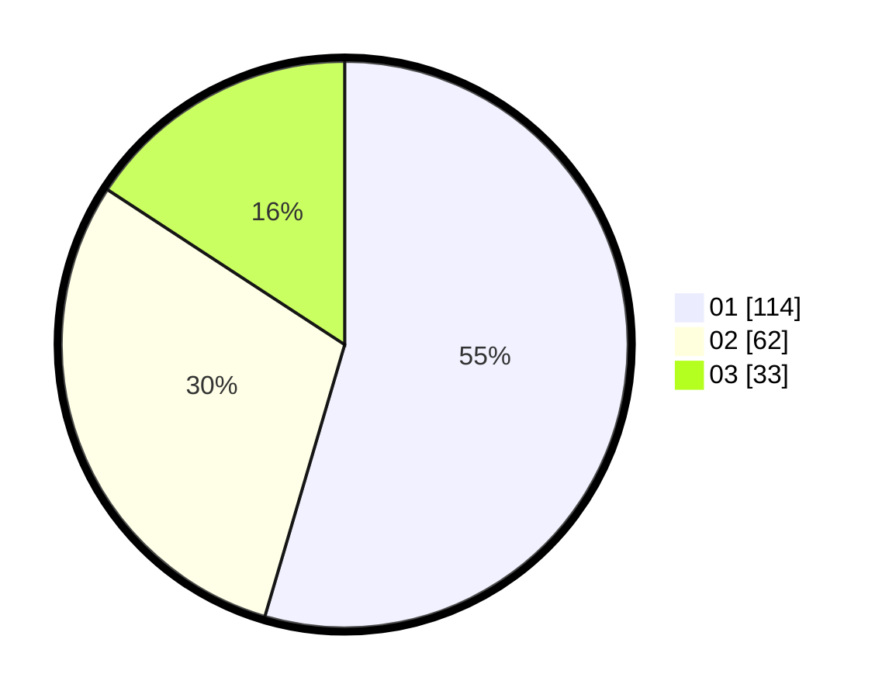

# Hasil

Hasil perolehan suara paslon dapat dilihat pada file paslon-01.txt, paslon-02.txt, dan paslon-03.txt.

Jika tidak ada, artinya data tersebut belum ada pada SIREKAP.

## Perolehan Suara

 * Paslon 01: **114**.
 * Paslon 02: **62**.
 * Paslon 03: **33**.

## Foto C Plano

https://sirekap-obj-formc.kpu.go.id/d18b/pemilu/ppwp/31/75/04/10/06/3175041006010-20240216-015413--7b45d66b-e5dc-4971-b475-02c93239a3ff.jpg

https://sirekap-obj-formc.kpu.go.id/d18b/pemilu/ppwp/31/75/04/10/06/3175041006010-20240216-015425--3c0e79ca-ebc8-4fd4-aa3c-ed676811bee1.jpg

https://sirekap-obj-formc.kpu.go.id/d18b/pemilu/ppwp/31/75/04/10/06/3175041006010-20240216-012844--eb5851aa-d441-4394-b8dc-35f884295907.jpg

## DATA PEMILIH TETAP

Jumlah pemilih dalam DPT: **273**.
 * L: **132**.
 * P: **141**.

## DATA PENGGUNA HAK PILIH

Jumlah pengguna hak pilih dalam DPT: **207**.
 * L: **93**.
 * P: **114**.

Jumlah pengguna hak pilih dalam DPTb: **1**.
 * L: **1**.
 * P: **0**.

Jumlah pengguna hak pilih dalam DPK: **2**.
 * L: **0**.
 * P: **2**.

Jumlah pengguna hak pilih: **210**.
 * L: **94**.
 * P: **116**.

## JUMLAH SUARA SAH DAN TIDAK SAH

JUMLAH SELURUH SUARA SAH: **209**.

JUMLAH SUARA TIDAK SAH: **1**.

JUMLAH SELURUH SUARA SAH DAN SUARA TIDAK SAH: **210**.
