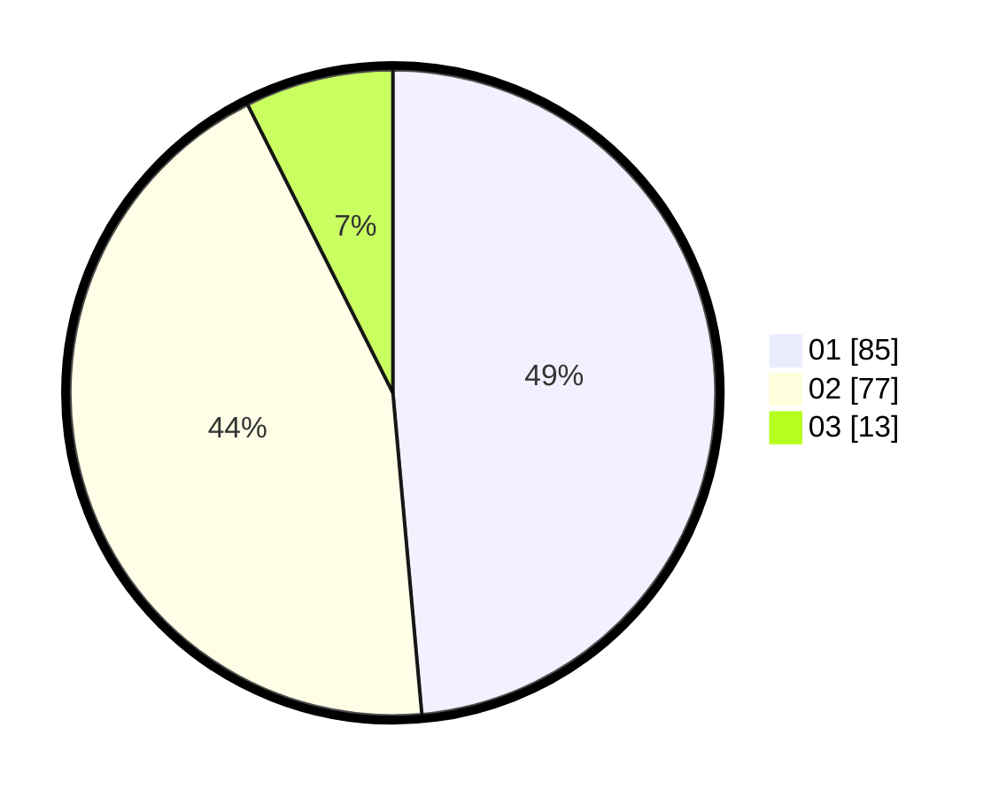

# Hasil

Hasil perolehan suara paslon dapat dilihat pada file paslon-01.txt, paslon-02.txt, dan paslon-03.txt.

Jika tidak ada, artinya data tersebut belum ada pada SIREKAP.

## Perolehan Suara

 * Paslon 01: **85**.
 * Paslon 02: **77**.
 * Paslon 03: **13**.

## Foto C Plano

https://sirekap-obj-formc.kpu.go.id/8ab7/pemilu/ppwp/31/75/04/10/06/3175041006034-20240214-222701--5f42597a-58a3-422d-aa7c-a10b46726d62.jpg

https://sirekap-obj-formc.kpu.go.id/8ab7/pemilu/ppwp/31/75/04/10/06/3175041006034-20240214-222706--6b7db228-243f-4eac-8b7f-ecdc1e44957c.jpg

https://sirekap-obj-formc.kpu.go.id/8ab7/pemilu/ppwp/31/75/04/10/06/3175041006034-20240216-071535--e09c213f-1ba2-4837-99c4-a232786d2025.jpg
