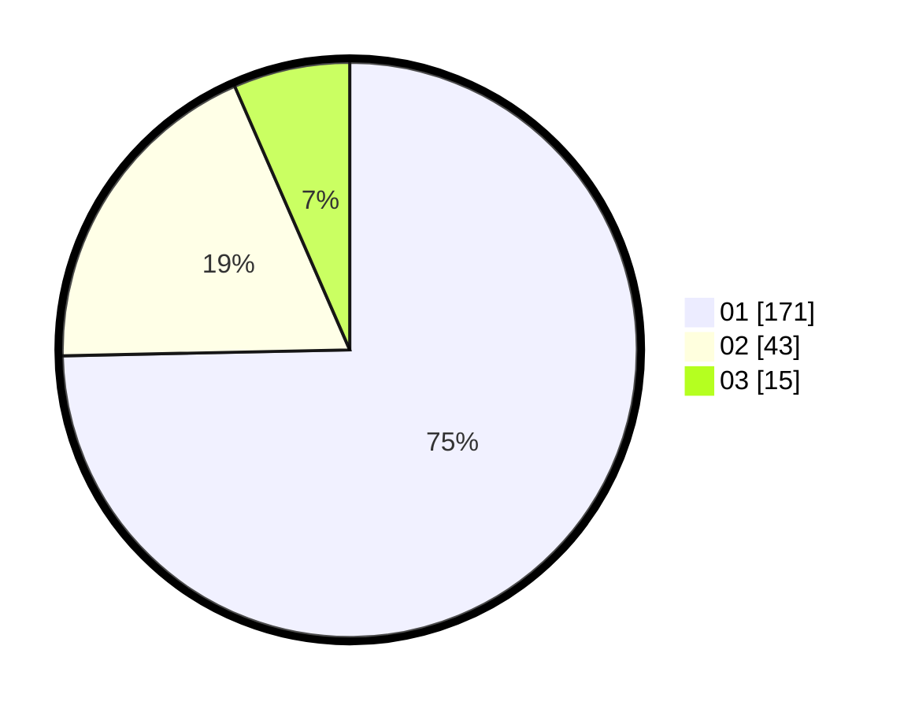

# Hasil

Hasil perolehan suara paslon dapat dilihat pada file paslon-01.txt, paslon-02.txt, dan paslon-03.txt.

Jika tidak ada, artinya data tersebut belum ada pada SIREKAP.

## Perolehan Suara

 * Paslon 01: **171**.
 * Paslon 02: **43**.
 * Paslon 03: **15**.

## Foto C Plano

https://sirekap-obj-formc.kpu.go.id/cb1f/pemilu/ppwp/31/75/04/10/06/3175041006035-20240214-220750--0de36781-adb7-47a5-a19e-d13a13733a36.jpg

https://sirekap-obj-formc.kpu.go.id/cb1f/pemilu/ppwp/31/75/04/10/06/3175041006035-20240214-220926--c903f241-fb18-4e5a-862a-e295cc138939.jpg

https://sirekap-obj-formc.kpu.go.id/cb1f/pemilu/ppwp/31/75/04/10/06/3175041006035-20240214-221043--082accf6-fd22-45b2-a92c-2aee3ea8568d.jpg
