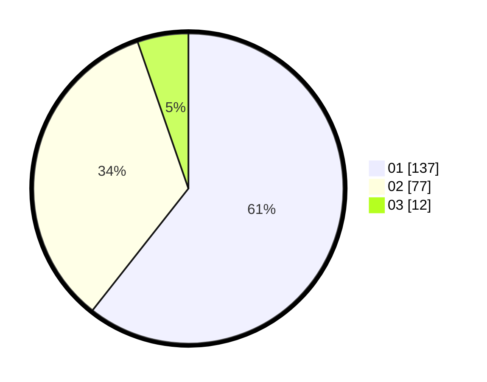

# Hasil

Hasil perolehan suara paslon dapat dilihat pada file paslon-01.txt, paslon-02.txt, dan paslon-03.txt.

Jika tidak ada, artinya data tersebut belum ada pada SIREKAP.

## Perolehan Suara

 * Paslon 01: **137**.
 * Paslon 02: **77**.
 * Paslon 03: **12**.

## Foto C Plano

https://sirekap-obj-formc.kpu.go.id/e732/pemilu/ppwp/31/75/04/10/06/3175041006038-20240214-230555--54d4c629-2a4a-4e07-a2ad-f17b6f5f2c1c.jpg

https://sirekap-obj-formc.kpu.go.id/e732/pemilu/ppwp/31/75/04/10/06/3175041006038-20240214-231028--600e2413-2690-4100-bbe5-79fab795a107.jpg

https://sirekap-obj-formc.kpu.go.id/e732/pemilu/ppwp/31/75/04/10/06/3175041006038-20240214-231225--6a3d5c1f-14a5-4e30-840c-613a73d62d03.jpg
