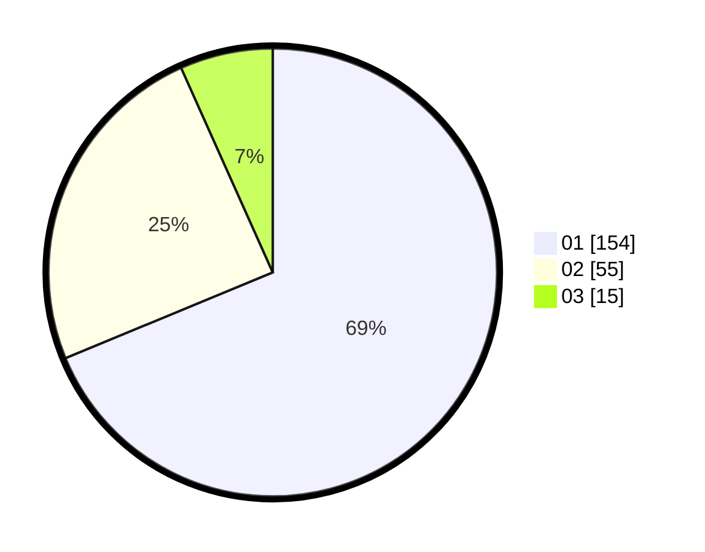

# Hasil

Hasil perolehan suara paslon dapat dilihat pada file paslon-01.txt, paslon-02.txt, dan paslon-03.txt.

Jika tidak ada, artinya data tersebut belum ada pada SIREKAP.

## Perolehan Suara

 * Paslon 01: **154**.
 * Paslon 02: **55**.
 * Paslon 03: **15**.

## Foto C Plano

https://sirekap-obj-formc.kpu.go.id/05db/pemilu/ppwp/31/75/04/10/06/3175041006053-20240216-100054--c2557de5-ff3c-4cab-be2b-970c08236e6b.jpg

https://sirekap-obj-formc.kpu.go.id/05db/pemilu/ppwp/31/75/04/10/06/3175041006053-20240216-100100--89ebd213-e2ba-45fa-99e5-8dd32bdbf02e.jpg

https://sirekap-obj-formc.kpu.go.id/05db/pemilu/ppwp/31/75/04/10/06/3175041006053-20240216-100056--291dcb90-497d-4a74-8b67-d6724073212d.jpg

## DATA PEMILIH TETAP

Jumlah pemilih dalam DPT: **270**.
 * L: **137**.
 * P: **133**.

## DATA PENGGUNA HAK PILIH

Jumlah pengguna hak pilih dalam DPT: **220**.
 * L: **109**.
 * P: **111**.

Jumlah pengguna hak pilih dalam DPTb: **1**.
 * L: **0**.
 * P: **1**.

Jumlah pengguna hak pilih dalam DPK: **4**.
 * L: **4**.
 * P: **0**.

Jumlah pengguna hak pilih: **225**.
 * L: **113**.
 * P: **112**.

## JUMLAH SUARA SAH DAN TIDAK SAH

JUMLAH SELURUH SUARA SAH: **224**.

JUMLAH SUARA TIDAK SAH: **1**.

JUMLAH SELURUH SUARA SAH DAN SUARA TIDAK SAH: **225**.
