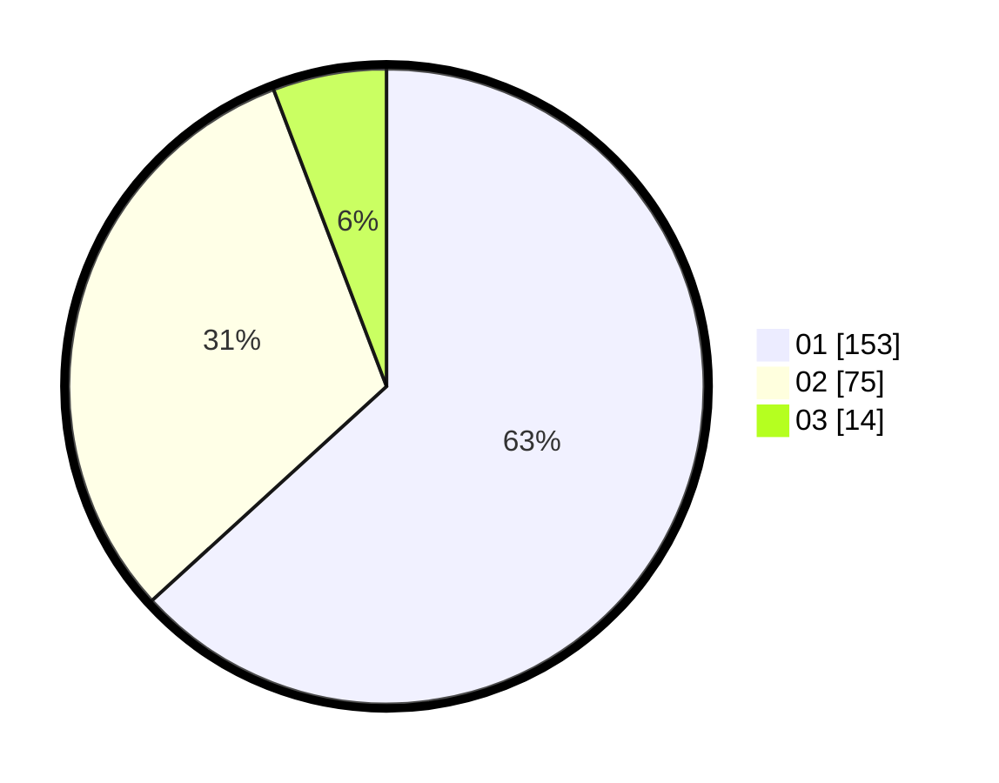

# Hasil

Hasil perolehan suara paslon dapat dilihat pada file paslon-01.txt, paslon-02.txt, dan paslon-03.txt.

Jika tidak ada, artinya data tersebut belum ada pada SIREKAP.

## Perolehan Suara

 * Paslon 01: **153**.
 * Paslon 02: **75**.
 * Paslon 03: **14**.

## Foto C Plano

https://sirekap-obj-formc.kpu.go.id/fcd6/pemilu/ppwp/31/75/04/10/06/3175041006057-20240216-175527--d19f8cc1-a6b6-4c27-a225-f88d90aafb55.jpg

https://sirekap-obj-formc.kpu.go.id/fcd6/pemilu/ppwp/31/75/04/10/06/3175041006057-20240216-175528--e7235cc4-8c78-4f1d-818f-544e48a11cb2.jpg

https://sirekap-obj-formc.kpu.go.id/fcd6/pemilu/ppwp/31/75/04/10/06/3175041006057-20240216-175528--3db19882-0e24-4478-a980-524540a84ab2.jpg

## DATA PEMILIH TETAP

Jumlah pemilih dalam DPT: **268**.
 * L: **131**.
 * P: **137**.

## DATA PENGGUNA HAK PILIH

Jumlah pengguna hak pilih dalam DPT: **234**.
 * L: **115**.
 * P: **119**.

Jumlah pengguna hak pilih dalam DPTb: **9**.
 * L: **9**.
 * P: **0**.

Jumlah pengguna hak pilih dalam DPK: **3**.
 * L: **1**.
 * P: **2**.

Jumlah pengguna hak pilih: **246**.
 * L: **125**.
 * P: **121**.

## JUMLAH SUARA SAH DAN TIDAK SAH

JUMLAH SELURUH SUARA SAH: **242**.

JUMLAH SUARA TIDAK SAH: **4**.

JUMLAH SELURUH SUARA SAH DAN SUARA TIDAK SAH: **246**.
