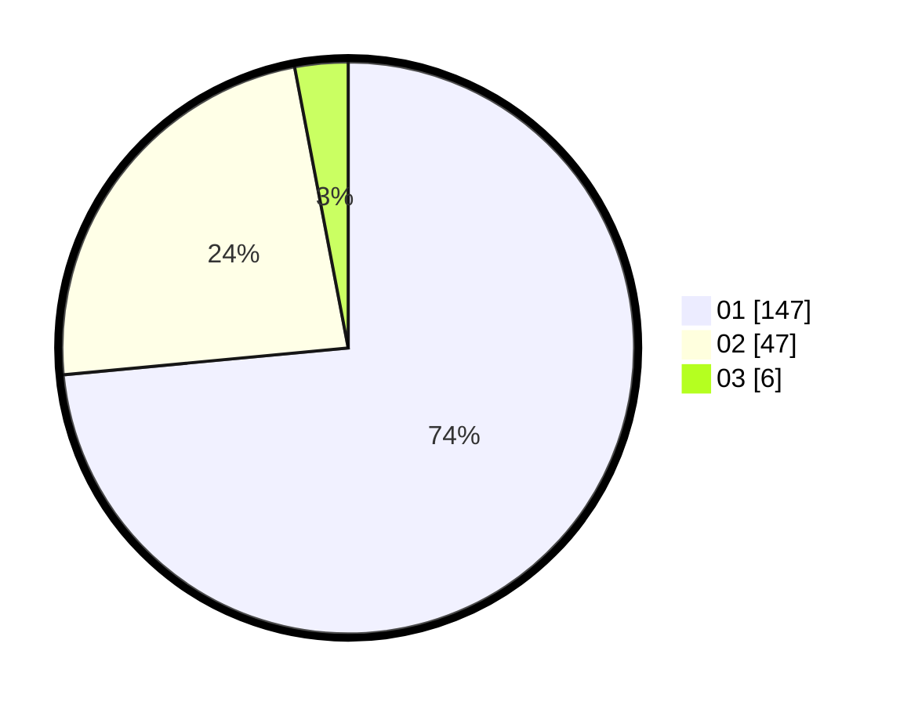

# Hasil

Hasil perolehan suara paslon dapat dilihat pada file paslon-01.txt, paslon-02.txt, dan paslon-03.txt.

Jika tidak ada, artinya data tersebut belum ada pada SIREKAP.

## Perolehan Suara

 * Paslon 01: **147**.
 * Paslon 02: **47**.
 * Paslon 03: **6**.

## Foto C Plano

https://sirekap-obj-formc.kpu.go.id/ffd4/pemilu/ppwp/31/75/04/10/06/3175041006063-20240214-155214--2b138a19-20a9-4c22-aa30-4c538e562c22.jpg

https://sirekap-obj-formc.kpu.go.id/ffd4/pemilu/ppwp/31/75/04/10/06/3175041006063-20240214-155544--56dffefd-35d4-4a96-ab5c-d1426738d391.jpg

https://sirekap-obj-formc.kpu.go.id/ffd4/pemilu/ppwp/31/75/04/10/06/3175041006063-20240214-155920--b7a4eafa-43ff-464d-8e58-cd879e3e2617.jpg
