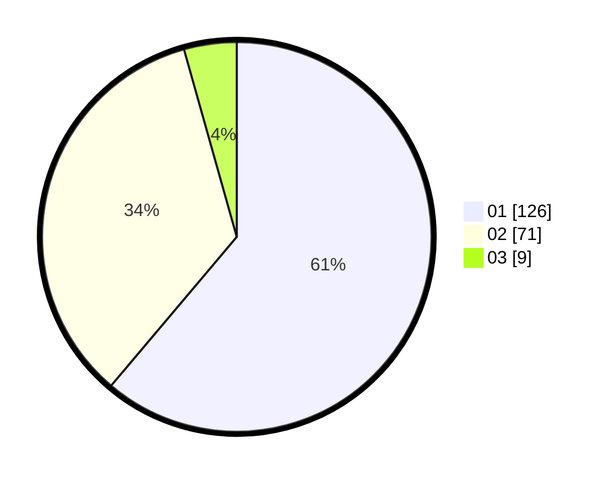

# Hasil

Hasil perolehan suara paslon dapat dilihat pada file paslon-01.txt, paslon-02.txt, dan paslon-03.txt.

Jika tidak ada, artinya data tersebut belum ada pada SIREKAP.

## Perolehan Suara

 * Paslon 01: **126**.
 * Paslon 02: **71**.
 * Paslon 03: **9**.

## Foto C Plano

https://sirekap-obj-formc.kpu.go.id/cbd5/pemilu/ppwp/31/75/04/10/06/3175041006065-20240214-155726--f410e243-bde6-4bbd-91e5-750caeb67dc0.jpg

https://sirekap-obj-formc.kpu.go.id/cbd5/pemilu/ppwp/31/75/04/10/06/3175041006065-20240214-160102--f431b241-002e-46ef-8aa4-3a9973cce94f.jpg

https://sirekap-obj-formc.kpu.go.id/cbd5/pemilu/ppwp/31/75/04/10/06/3175041006065-20240214-162218--a357c738-4528-4f7b-a398-3b8fe899b372.jpg

## DATA PEMILIH TETAP

Jumlah pemilih dalam DPT: **269**.
 * L: **130**.
 * P: **139**.

## DATA PENGGUNA HAK PILIH

Jumlah pengguna hak pilih dalam DPT: **209**.
 * L: **100**.
 * P: **109**.

Jumlah pengguna hak pilih dalam DPTb: **1**.
 * L: **0**.
 * P: **1**.

Jumlah pengguna hak pilih dalam DPK: **1**.
 * L: **1**.
 * P: **0**.

Jumlah pengguna hak pilih: **211**.
 * L: **101**.
 * P: **110**.

## JUMLAH SUARA SAH DAN TIDAK SAH

JUMLAH SELURUH SUARA SAH: **206**.

JUMLAH SUARA TIDAK SAH: **5**.

JUMLAH SELURUH SUARA SAH DAN SUARA TIDAK SAH: **211**.
