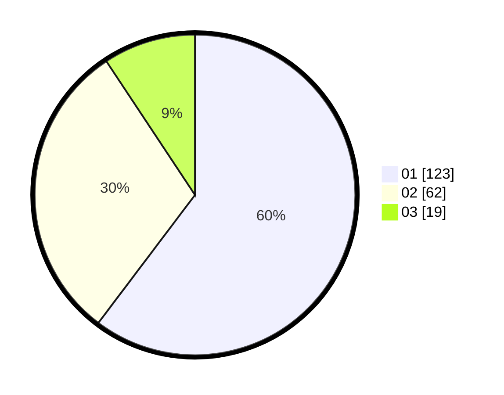

# Hasil

Hasil perolehan suara paslon dapat dilihat pada file paslon-01.txt, paslon-02.txt, dan paslon-03.txt.

Jika tidak ada, artinya data tersebut belum ada pada SIREKAP.

## Perolehan Suara

 * Paslon 01: **123**.
 * Paslon 02: **62**.
 * Paslon 03: **19**.

## Foto C Plano

https://sirekap-obj-formc.kpu.go.id/2a30/pemilu/ppwp/31/75/04/10/06/3175041006069-20240214-191345--cd2488d4-2925-400d-8405-9a477d7938d1.jpg

https://sirekap-obj-formc.kpu.go.id/2a30/pemilu/ppwp/31/75/04/10/06/3175041006069-20240219-193520--2d762adc-e58e-4da7-a1e8-ddcff4dbd412.jpg

https://sirekap-obj-formc.kpu.go.id/2a30/pemilu/ppwp/31/75/04/10/06/3175041006069-20240219-193626--b034df95-b84a-43a6-8d54-f5ad1deed8ae.jpg

## DATA PEMILIH TETAP

Jumlah pemilih dalam DPT: **270**.
 * L: **127**.
 * P: **143**.

## DATA PENGGUNA HAK PILIH

Jumlah pengguna hak pilih dalam DPT: **206**.
 * L: **113**.
 * P: **93**.

Jumlah pengguna hak pilih dalam DPTb: **0**.
 * L: **0**.
 * P: **0**.

Jumlah pengguna hak pilih dalam DPK: **1**.
 * L: **1**.
 * P: **0**.

Jumlah pengguna hak pilih: **207**.
 * L: **114**.
 * P: **93**.

## JUMLAH SUARA SAH DAN TIDAK SAH

JUMLAH SELURUH SUARA SAH: **204**.

JUMLAH SUARA TIDAK SAH: **3**.

JUMLAH SELURUH SUARA SAH DAN SUARA TIDAK SAH: **207**.
