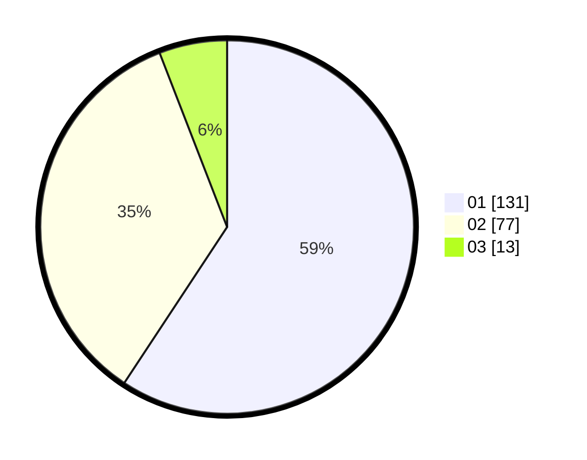

# Hasil

Hasil perolehan suara paslon dapat dilihat pada file paslon-01.txt, paslon-02.txt, dan paslon-03.txt.

Jika tidak ada, artinya data tersebut belum ada pada SIREKAP.

## Perolehan Suara

 * Paslon 01: **131**.
 * Paslon 02: **77**.
 * Paslon 03: **13**.

## Foto C Plano

https://sirekap-obj-formc.kpu.go.id/757d/pemilu/ppwp/31/75/04/10/06/3175041006071-20240214-193835--25fb2199-57cb-4cb0-abbd-f9eab8399d68.jpg

https://sirekap-obj-formc.kpu.go.id/757d/pemilu/ppwp/31/75/04/10/06/3175041006071-20240214-194002--3dd01f36-aaa1-4a00-8f5f-01a030cd3dea.jpg
