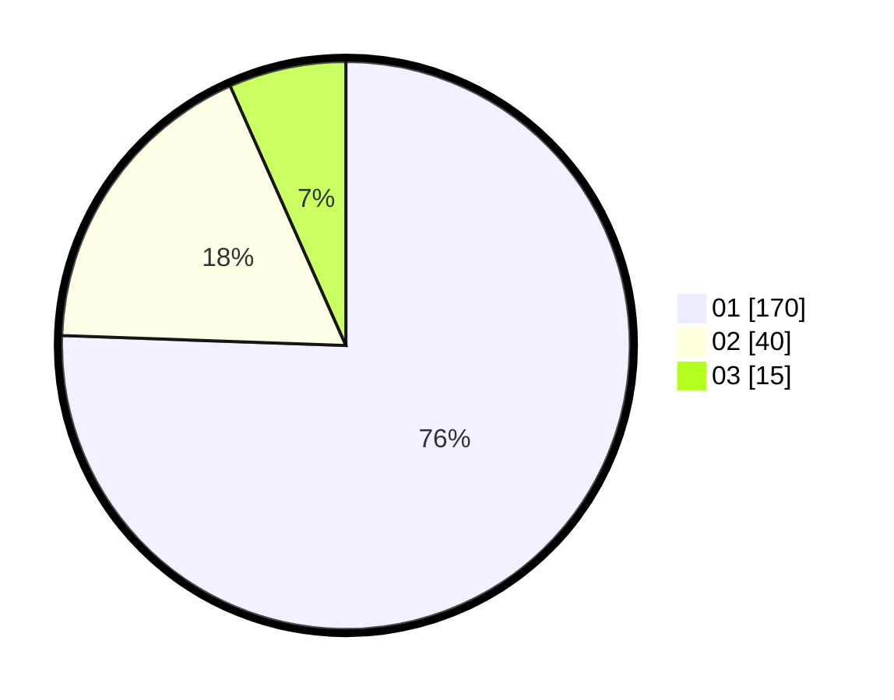

# Hasil

Hasil perolehan suara paslon dapat dilihat pada file paslon-01.txt, paslon-02.txt, dan paslon-03.txt.

Jika tidak ada, artinya data tersebut belum ada pada SIREKAP.

## Perolehan Suara

 * Paslon 01: **170**.
 * Paslon 02: **40**.
 * Paslon 03: **15**.

## Foto C Plano

https://sirekap-obj-formc.kpu.go.id/727c/pemilu/ppwp/31/75/04/10/06/3175041006080-20240214-230745--07057d5f-2147-47c9-9d7b-6f56ff333743.jpg

https://sirekap-obj-formc.kpu.go.id/727c/pemilu/ppwp/31/75/04/10/06/3175041006080-20240214-230857--0a6df9ac-dcfc-4660-9f2f-0f8ca855db55.jpg

https://sirekap-obj-formc.kpu.go.id/727c/pemilu/ppwp/31/75/04/10/06/3175041006080-20240214-231018--80fd059d-d1b2-49f3-955d-072c13e6e45d.jpg
