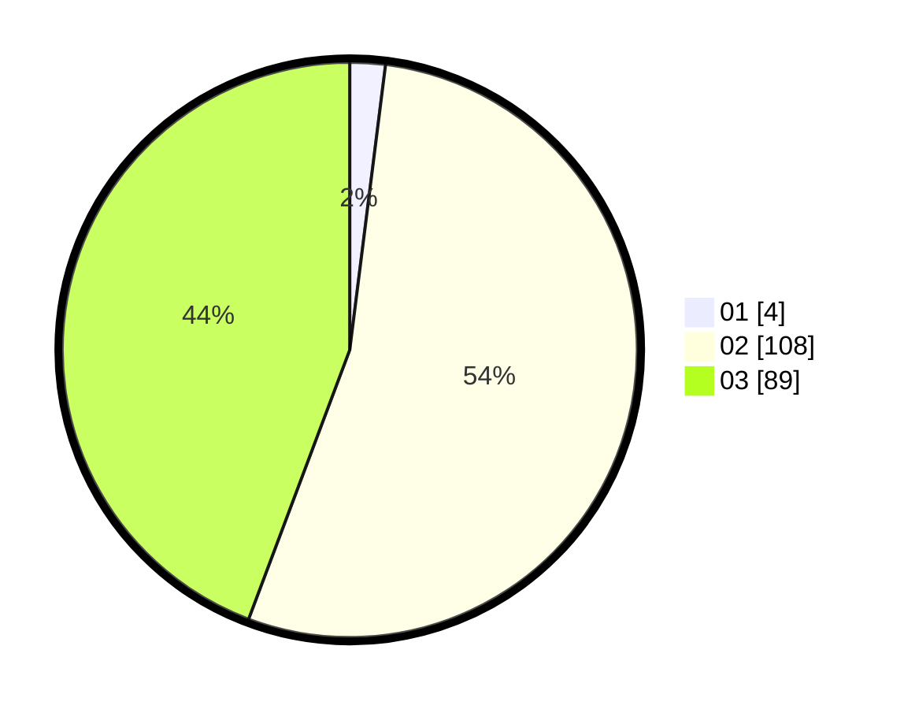

# Hasil

Hasil perolehan suara paslon dapat dilihat pada file paslon-01.txt, paslon-02.txt, dan paslon-03.txt.

Jika tidak ada, artinya data tersebut belum ada pada SIREKAP.

## Perolehan Suara

 * Paslon 01: **4**.
 * Paslon 02: **108**.
 * Paslon 03: **89**.

## Foto C Plano

https://sirekap-obj-formc.kpu.go.id/241d/pemilu/ppwp/31/75/04/10/06/3175041006083-20240214-213033--43517625-2121-4ee2-9006-859b813133d1.jpg

https://sirekap-obj-formc.kpu.go.id/241d/pemilu/ppwp/31/75/04/10/06/3175041006083-20240214-225356--0bafe084-2a12-470b-a06d-46a9d2c2d132.jpg

https://sirekap-obj-formc.kpu.go.id/241d/pemilu/ppwp/31/75/04/10/06/3175041006083-20240214-213133--24224e69-0ebb-4baa-a39a-88c2ed6b8ce3.jpg
