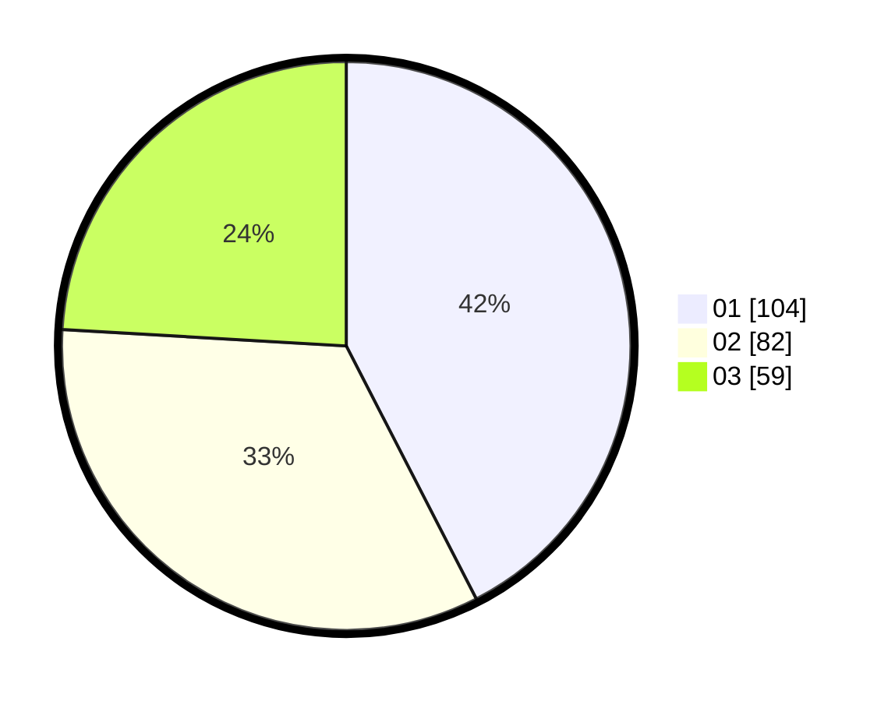

# Hasil

Hasil perolehan suara paslon dapat dilihat pada file paslon-01.txt, paslon-02.txt, dan paslon-03.txt.

Jika tidak ada, artinya data tersebut belum ada pada SIREKAP.

## Perolehan Suara

 * Paslon 01: **104**.
 * Paslon 02: **82**.
 * Paslon 03: **59**.

## Foto C Plano

https://sirekap-obj-formc.kpu.go.id/1656/pemilu/ppwp/31/75/04/10/06/3175041006090-20240215-143104--838a7ad7-f533-46b8-9420-9fef9069eaba.jpg

https://sirekap-obj-formc.kpu.go.id/1656/pemilu/ppwp/31/75/04/10/06/3175041006090-20240215-143432--ae63080f-bfea-4c1f-8ad0-d76995e4db0d.jpg

https://sirekap-obj-formc.kpu.go.id/1656/pemilu/ppwp/31/75/04/10/06/3175041006090-20240215-143632--a3c32756-539c-4a3d-96fd-fb108927f431.jpg
