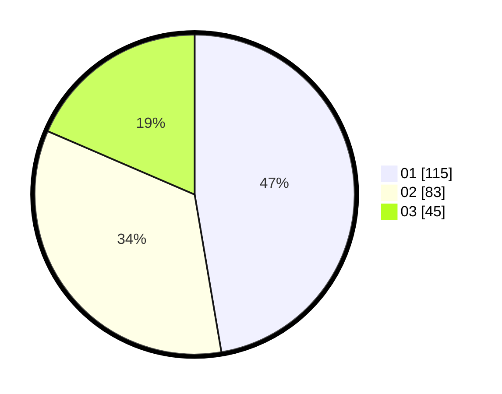

# Hasil

Hasil perolehan suara paslon dapat dilihat pada file paslon-01.txt, paslon-02.txt, dan paslon-03.txt.

Jika tidak ada, artinya data tersebut belum ada pada SIREKAP.

## Perolehan Suara

 * Paslon 01: **115**.
 * Paslon 02: **83**.
 * Paslon 03: **45**.

## Foto C Plano

https://sirekap-obj-formc.kpu.go.id/d208/pemilu/ppwp/31/75/04/10/06/3175041006092-20240214-155140--111eb900-1bec-4002-8b0a-abbd9fbd47ed.jpg

https://sirekap-obj-formc.kpu.go.id/d208/pemilu/ppwp/31/75/04/10/06/3175041006092-20240214-155157--75d1d98f-d281-40f4-88ea-1106b9e0b972.jpg

https://sirekap-obj-formc.kpu.go.id/d208/pemilu/ppwp/31/75/04/10/06/3175041006092-20240214-155131--ec969ea5-b730-43e0-8309-c86bddb256f3.jpg

## DATA PEMILIH TETAP

Jumlah pemilih dalam DPT: **291**.
 * L: **141**.
 * P: **150**.

## DATA PENGGUNA HAK PILIH

Jumlah pengguna hak pilih dalam DPT: **237**.
 * L: **115**.
 * P: **122**.

Jumlah pengguna hak pilih dalam DPTb: **7**.
 * L: **3**.
 * P: **4**.

Jumlah pengguna hak pilih dalam DPK: **4**.
 * L: **2**.
 * P: **2**.

Jumlah pengguna hak pilih: **248**.
 * L: **120**.
 * P: **128**.

## JUMLAH SUARA SAH DAN TIDAK SAH

JUMLAH SELURUH SUARA SAH: **243**.

JUMLAH SUARA TIDAK SAH: **5**.

JUMLAH SELURUH SUARA SAH DAN SUARA TIDAK SAH: **248**.
