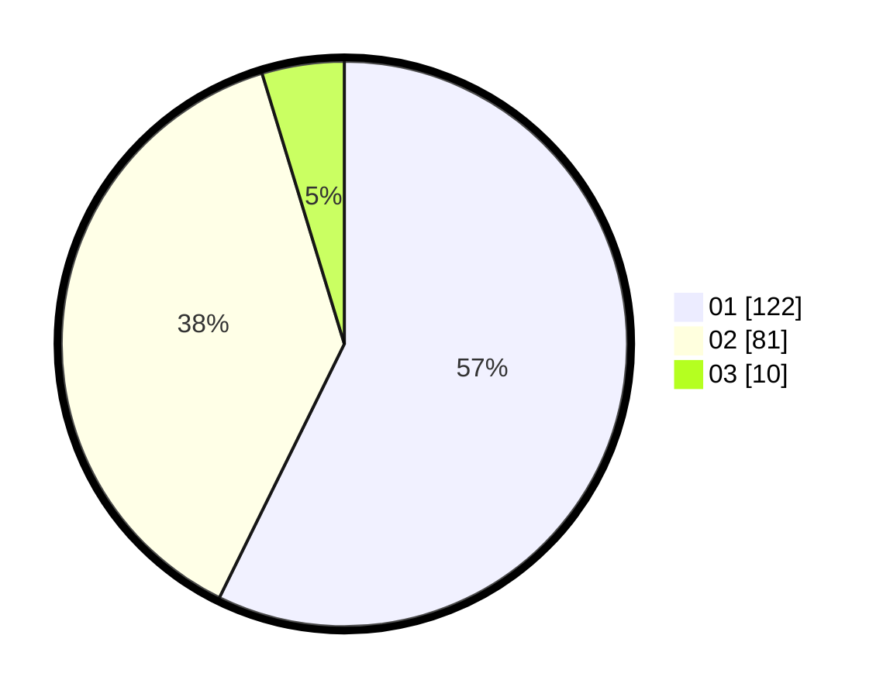

# Hasil

Hasil perolehan suara paslon dapat dilihat pada file paslon-01.txt, paslon-02.txt, dan paslon-03.txt.

Jika tidak ada, artinya data tersebut belum ada pada SIREKAP.

## Perolehan Suara

 * Paslon 01: **122**.
 * Paslon 02: **81**.
 * Paslon 03: **10**.

## Foto C Plano

https://sirekap-obj-formc.kpu.go.id/c68c/pemilu/ppwp/31/75/04/10/06/3175041006102-20240215-004519--1c510577-2556-4f0e-b3f7-053de3930904.jpg

https://sirekap-obj-formc.kpu.go.id/c68c/pemilu/ppwp/31/75/04/10/06/3175041006102-20240215-004656--23ff51d1-5da0-4578-8730-5c7b5c232611.jpg

https://sirekap-obj-formc.kpu.go.id/c68c/pemilu/ppwp/31/75/04/10/06/3175041006102-20240215-004914--4ad4ff0e-339a-4dc0-874f-de95d48953db.jpg
