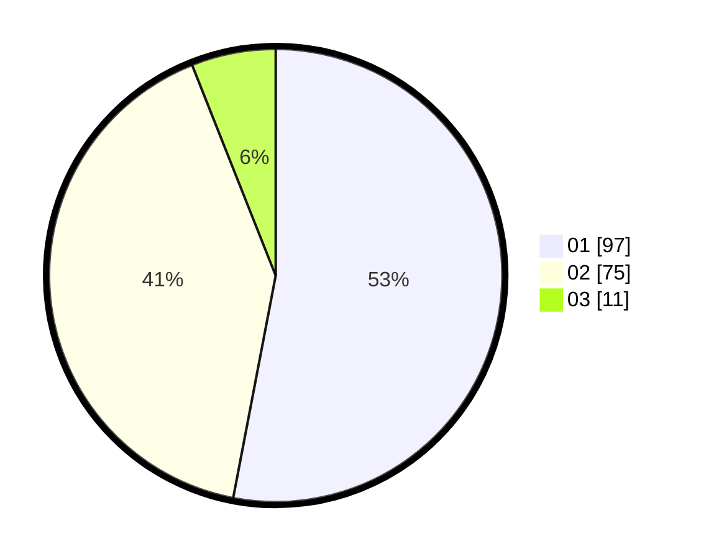

# Hasil

Hasil perolehan suara paslon dapat dilihat pada file paslon-01.txt, paslon-02.txt, dan paslon-03.txt.

Jika tidak ada, artinya data tersebut belum ada pada SIREKAP.

## Perolehan Suara

 * Paslon 01: **97**.
 * Paslon 02: **75**.
 * Paslon 03: **11**.

## Foto C Plano

https://sirekap-obj-formc.kpu.go.id/f3b2/pemilu/ppwp/31/75/04/10/06/3175041006118-20240214-190925--e30f5645-0c53-4ce3-be1b-e9b8904ddb5e.jpg

https://sirekap-obj-formc.kpu.go.id/f3b2/pemilu/ppwp/31/75/04/10/06/3175041006118-20240214-201412--e03bb71a-b5f0-4eef-af49-545c70447dac.jpg

https://sirekap-obj-formc.kpu.go.id/f3b2/pemilu/ppwp/31/75/04/10/06/3175041006118-20240214-201504--9eee58ca-1e08-4c7a-ab4f-95a5015fe2ca.jpg

## DATA PEMILIH TETAP

Jumlah pemilih dalam DPT: **263**.
 * L: **133**.
 * P: **130**.

## DATA PENGGUNA HAK PILIH

Jumlah pengguna hak pilih dalam DPT: **182**.
 * L: **89**.
 * P: **93**.

Jumlah pengguna hak pilih dalam DPTb: **0**.
 * L: **0**.
 * P: **0**.

Jumlah pengguna hak pilih dalam DPK: **2**.
 * L: **1**.
 * P: **1**.

Jumlah pengguna hak pilih: **184**.
 * L: **90**.
 * P: **94**.

## JUMLAH SUARA SAH DAN TIDAK SAH

JUMLAH SELURUH SUARA SAH: **183**.

JUMLAH SUARA TIDAK SAH: **1**.

JUMLAH SELURUH SUARA SAH DAN SUARA TIDAK SAH: **184**.
