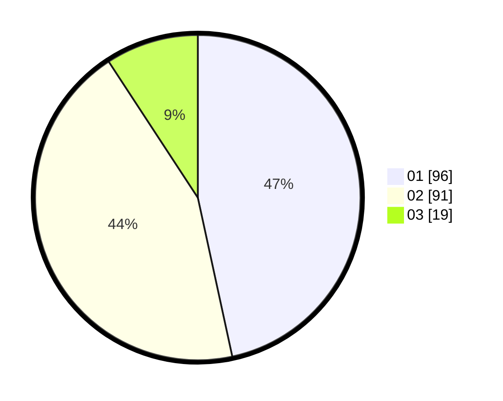

# Hasil

Hasil perolehan suara paslon dapat dilihat pada file paslon-01.txt, paslon-02.txt, dan paslon-03.txt.

Jika tidak ada, artinya data tersebut belum ada pada SIREKAP.

## Perolehan Suara

 * Paslon 01: **96**.
 * Paslon 02: **91**.
 * Paslon 03: **19**.

## Foto C Plano

https://sirekap-obj-formc.kpu.go.id/9f96/pemilu/ppwp/31/75/04/10/06/3175041006122-20240214-203658--ef9aa145-1078-4c18-9778-47af27a4310a.jpg

https://sirekap-obj-formc.kpu.go.id/9f96/pemilu/ppwp/31/75/04/10/06/3175041006122-20240214-214907--6db024fd-2808-4b92-bdb3-184de5cfd43e.jpg

https://sirekap-obj-formc.kpu.go.id/9f96/pemilu/ppwp/31/75/04/10/06/3175041006122-20240214-214840--f4ce07fb-eccd-4893-b5a9-d0b6dfb901da.jpg

## DATA PEMILIH TETAP

Jumlah pemilih dalam DPT: **287**.
 * L: **148**.
 * P: **139**.

## DATA PENGGUNA HAK PILIH

Jumlah pengguna hak pilih dalam DPT: **200**.
 * L: **99**.
 * P: **101**.

Jumlah pengguna hak pilih dalam DPTb: **1**.
 * L: **1**.
 * P: **0**.

Jumlah pengguna hak pilih dalam DPK: **6**.
 * L: **3**.
 * P: **3**.

Jumlah pengguna hak pilih: **207**.
 * L: **103**.
 * P: **104**.

## JUMLAH SUARA SAH DAN TIDAK SAH

JUMLAH SELURUH SUARA SAH: **206**.

JUMLAH SUARA TIDAK SAH: **1**.

JUMLAH SELURUH SUARA SAH DAN SUARA TIDAK SAH: **207**.
