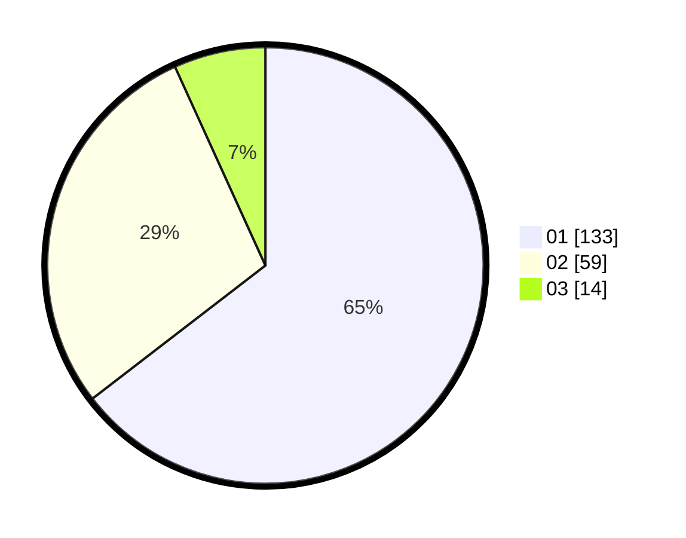

# Hasil

Hasil perolehan suara paslon dapat dilihat pada file paslon-01.txt, paslon-02.txt, dan paslon-03.txt.

Jika tidak ada, artinya data tersebut belum ada pada SIREKAP.

## Perolehan Suara

 * Paslon 01: **133**.
 * Paslon 02: **59**.
 * Paslon 03: **14**.

## Foto C Plano

https://sirekap-obj-formc.kpu.go.id/a165/pemilu/ppwp/31/75/04/10/06/3175041006127-20240216-115611--86c4bcb1-fb26-4b32-af46-e6d20fd357cf.jpg

https://sirekap-obj-formc.kpu.go.id/a165/pemilu/ppwp/31/75/04/10/06/3175041006127-20240216-165528--a8d8ee1b-348d-4df3-b8b9-f46b078e4434.jpg

https://sirekap-obj-formc.kpu.go.id/a165/pemilu/ppwp/31/75/04/10/06/3175041006127-20240216-165810--8943f0e3-9b27-4a6c-9d6b-675bff735192.jpg

## DATA PEMILIH TETAP

Jumlah pemilih dalam DPT: **261**.
 * L: **131**.
 * P: **130**.

## DATA PENGGUNA HAK PILIH

Jumlah pengguna hak pilih dalam DPT: **206**.
 * L: **102**.
 * P: **104**.

Jumlah pengguna hak pilih dalam DPTb: **0**.
 * L: **0**.
 * P: **0**.

Jumlah pengguna hak pilih dalam DPK: **2**.
 * L: **1**.
 * P: **1**.

Jumlah pengguna hak pilih: **208**.
 * L: **103**.
 * P: **105**.

## JUMLAH SUARA SAH DAN TIDAK SAH

JUMLAH SELURUH SUARA SAH: **206**.

JUMLAH SUARA TIDAK SAH: **2**.

JUMLAH SELURUH SUARA SAH DAN SUARA TIDAK SAH: **208**.
