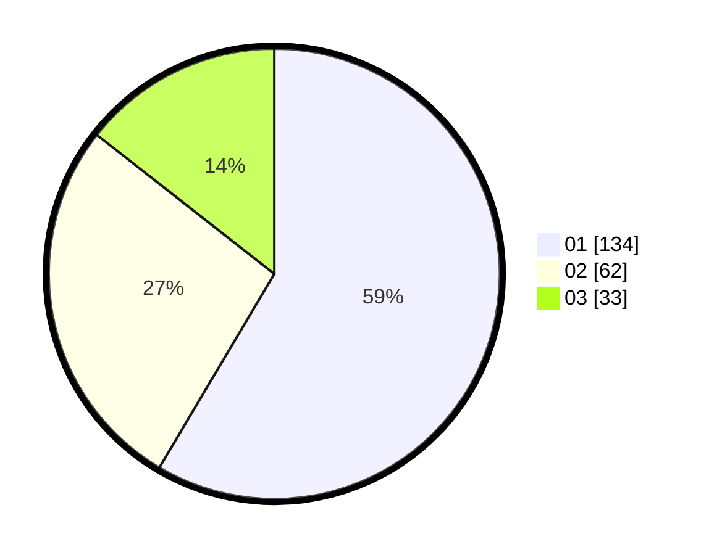

# Hasil

Hasil perolehan suara paslon dapat dilihat pada file paslon-01.txt, paslon-02.txt, dan paslon-03.txt.

Jika tidak ada, artinya data tersebut belum ada pada SIREKAP.

## Perolehan Suara

 * Paslon 01: **134**.
 * Paslon 02: **62**.
 * Paslon 03: **33**.

## Foto C Plano

https://sirekap-obj-formc.kpu.go.id/3021/pemilu/ppwp/31/75/04/10/06/3175041006130-20240214-212101--5decb070-006c-4019-b726-454ad3e92800.jpg

https://sirekap-obj-formc.kpu.go.id/3021/pemilu/ppwp/31/75/04/10/06/3175041006130-20240214-233601--2cbe5c44-b4ac-4e55-9b45-f3ad388d0526.jpg

https://sirekap-obj-formc.kpu.go.id/3021/pemilu/ppwp/31/75/04/10/06/3175041006130-20240214-233735--42247951-2b96-4e71-bcfe-33aaa960c8a8.jpg

## DATA PEMILIH TETAP

Jumlah pemilih dalam DPT: **264**.
 * L: **129**.
 * P: **135**.

## DATA PENGGUNA HAK PILIH

Jumlah pengguna hak pilih dalam DPT: **215**.
 * L: **98**.
 * P: **117**.

Jumlah pengguna hak pilih dalam DPTb: **9**.
 * L: **2**.
 * P: **7**.

Jumlah pengguna hak pilih dalam DPK: **7**.
 * L: **3**.
 * P: **4**.

Jumlah pengguna hak pilih: **231**.
 * L: **103**.
 * P: **128**.

## JUMLAH SUARA SAH DAN TIDAK SAH

JUMLAH SELURUH SUARA SAH: **229**.

JUMLAH SUARA TIDAK SAH: **2**.

JUMLAH SELURUH SUARA SAH DAN SUARA TIDAK SAH: **231**.
