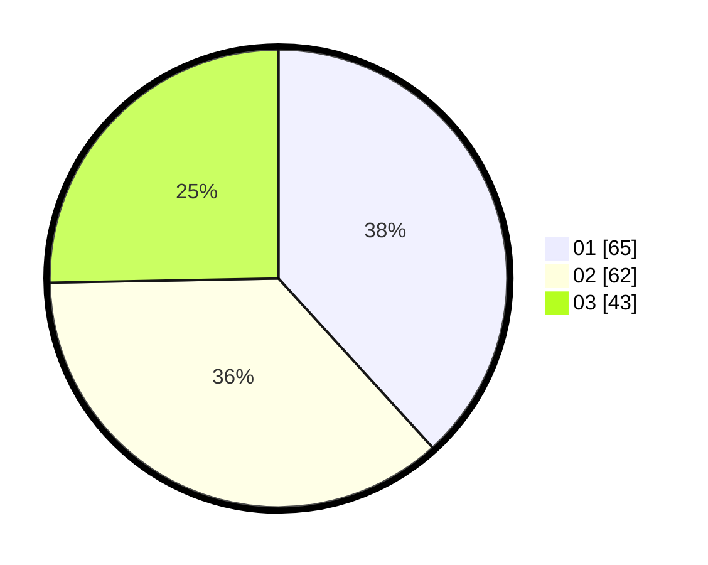

# Hasil

Hasil perolehan suara paslon dapat dilihat pada file paslon-01.txt, paslon-02.txt, dan paslon-03.txt.

Jika tidak ada, artinya data tersebut belum ada pada SIREKAP.

## Perolehan Suara

 * Paslon 01: **65**.
 * Paslon 02: **62**.
 * Paslon 03: **43**.

## Foto C Plano

https://sirekap-obj-formc.kpu.go.id/8dae/pemilu/ppwp/31/75/04/10/07/3175041007002-20240215-032307--97da1212-7208-41a9-88c0-dea544cbf4b7.jpg

https://sirekap-obj-formc.kpu.go.id/8dae/pemilu/ppwp/31/75/04/10/07/3175041007002-20240215-032351--16e5af78-be3d-4835-81c4-33d3b238ee4c.jpg

https://sirekap-obj-formc.kpu.go.id/8dae/pemilu/ppwp/31/75/04/10/07/3175041007002-20240215-032454--fe1883f6-a418-4663-be73-ef3bf8fcfb4f.jpg

## DATA PEMILIH TETAP

Jumlah pemilih dalam DPT: **219**.
 * L: **118**.
 * P: **101**.

## DATA PENGGUNA HAK PILIH

Jumlah pengguna hak pilih dalam DPT: **131**.
 * L: **66**.
 * P: **65**.

Jumlah pengguna hak pilih dalam DPTb: **28**.
 * L: **12**.
 * P: **16**.

Jumlah pengguna hak pilih dalam DPK: **19**.
 * L: **8**.
 * P: **11**.

Jumlah pengguna hak pilih: **178**.
 * L: **86**.
 * P: **92**.

## JUMLAH SUARA SAH DAN TIDAK SAH

JUMLAH SELURUH SUARA SAH: **170**.

JUMLAH SUARA TIDAK SAH: **8**.

JUMLAH SELURUH SUARA SAH DAN SUARA TIDAK SAH: **178**.
