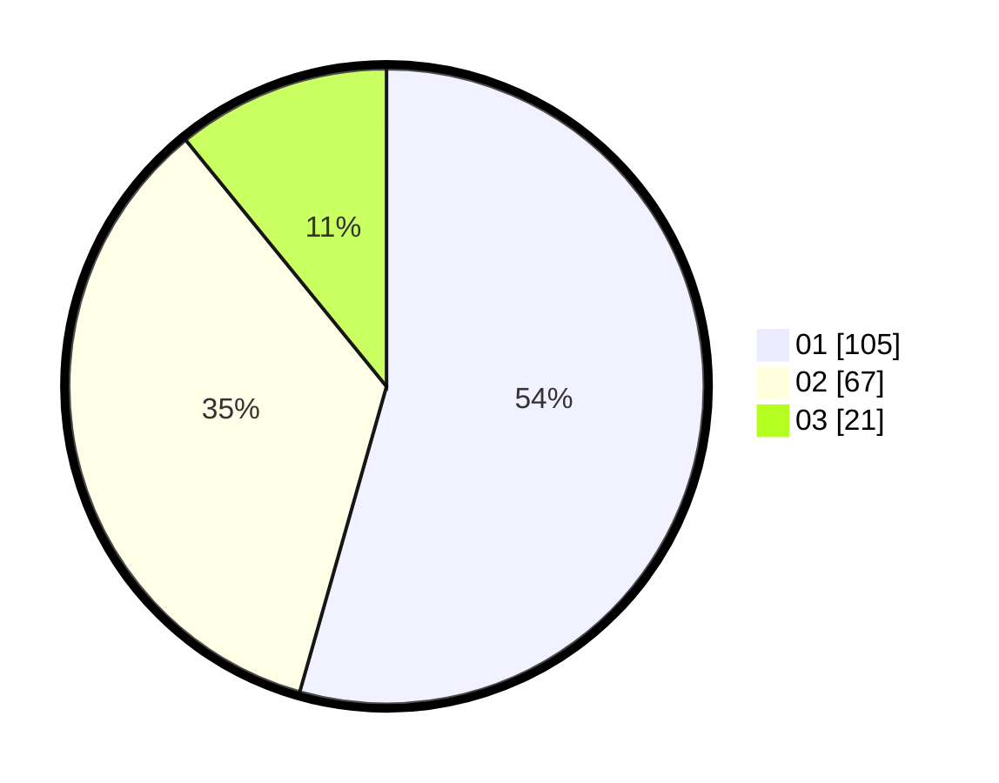

# Hasil

Hasil perolehan suara paslon dapat dilihat pada file paslon-01.txt, paslon-02.txt, dan paslon-03.txt.

Jika tidak ada, artinya data tersebut belum ada pada SIREKAP.

## Perolehan Suara

 * Paslon 01: **105**.
 * Paslon 02: **67**.
 * Paslon 03: **21**.

## Foto C Plano

https://sirekap-obj-formc.kpu.go.id/e90f/pemilu/ppwp/31/75/04/10/07/3175041007007-20240214-155917--0b8229c9-dedf-440c-8491-e57954483663.jpg

https://sirekap-obj-formc.kpu.go.id/e90f/pemilu/ppwp/31/75/04/10/07/3175041007007-20240214-160148--3800accd-a0e5-42c1-9a52-55d2f8ed5d7e.jpg

https://sirekap-obj-formc.kpu.go.id/e90f/pemilu/ppwp/31/75/04/10/07/3175041007007-20240214-160137--a1e966d9-5a48-45bc-9ae7-5b4103fcac35.jpg

## DATA PEMILIH TETAP

Jumlah pemilih dalam DPT: **284**.
 * L: **145**.
 * P: **139**.

## DATA PENGGUNA HAK PILIH

Jumlah pengguna hak pilih dalam DPT: **186**.
 * L: **92**.
 * P: **94**.

Jumlah pengguna hak pilih dalam DPTb: **4**.
 * L: **1**.
 * P: **3**.

Jumlah pengguna hak pilih dalam DPK: **4**.
 * L: **2**.
 * P: **2**.

Jumlah pengguna hak pilih: **194**.
 * L: **95**.
 * P: **99**.

## JUMLAH SUARA SAH DAN TIDAK SAH

JUMLAH SELURUH SUARA SAH: **193**.

JUMLAH SUARA TIDAK SAH: **1**.

JUMLAH SELURUH SUARA SAH DAN SUARA TIDAK SAH: **194**.
