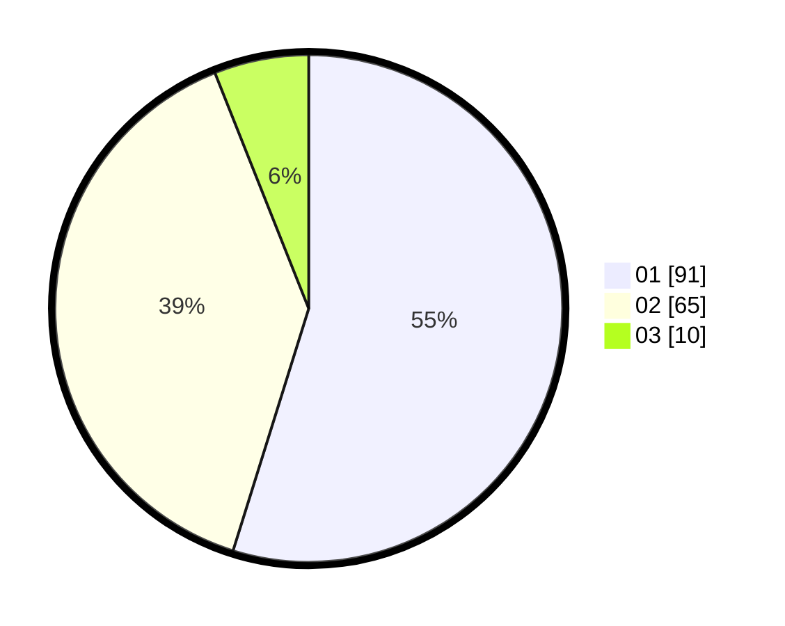

# Hasil

Hasil perolehan suara paslon dapat dilihat pada file paslon-01.txt, paslon-02.txt, dan paslon-03.txt.

Jika tidak ada, artinya data tersebut belum ada pada SIREKAP.

## Perolehan Suara

 * Paslon 01: **91**.
 * Paslon 02: **65**.
 * Paslon 03: **10**.

## Foto C Plano

https://sirekap-obj-formc.kpu.go.id/df69/pemilu/ppwp/31/75/04/10/07/3175041007013-20240214-202619--8e378259-0e04-4d53-b65a-39f9c5a058ec.jpg

https://sirekap-obj-formc.kpu.go.id/df69/pemilu/ppwp/31/75/04/10/07/3175041007013-20240214-202732--03f5ec6f-078d-4554-937a-be39b0c1ccb1.jpg

https://sirekap-obj-formc.kpu.go.id/df69/pemilu/ppwp/31/75/04/10/07/3175041007013-20240214-202838--7f093787-0446-48e0-bed6-b1d4aa096766.jpg

## DATA PEMILIH TETAP

Jumlah pemilih dalam DPT: **171**.
 * L: **75**.
 * P: **96**.

## DATA PENGGUNA HAK PILIH

Jumlah pengguna hak pilih dalam DPT: **171**.
 * L: **75**.
 * P: **96**.

Jumlah pengguna hak pilih dalam DPTb: **0**.
 * L: **0**.
 * P: **0**.

Jumlah pengguna hak pilih dalam DPK: **0**.
 * L: **0**.
 * P: **0**.

Jumlah pengguna hak pilih: **171**.
 * L: **75**.
 * P: **96**.

## JUMLAH SUARA SAH DAN TIDAK SAH

JUMLAH SELURUH SUARA SAH: **166**.

JUMLAH SUARA TIDAK SAH: **5**.

JUMLAH SELURUH SUARA SAH DAN SUARA TIDAK SAH: **171**.
