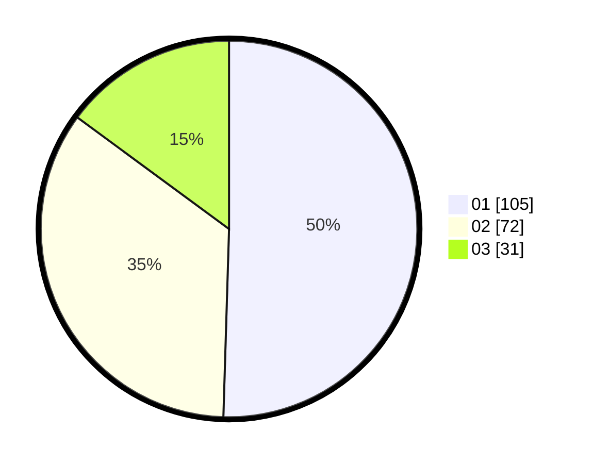

# Hasil

Hasil perolehan suara paslon dapat dilihat pada file paslon-01.txt, paslon-02.txt, dan paslon-03.txt.

Jika tidak ada, artinya data tersebut belum ada pada SIREKAP.

## Perolehan Suara

 * Paslon 01: **105**.
 * Paslon 02: **72**.
 * Paslon 03: **31**.

## Foto C Plano

https://sirekap-obj-formc.kpu.go.id/8749/pemilu/ppwp/31/75/04/10/07/3175041007014-20240215-001101--cd21c697-7991-40da-b3d4-4a5e5d66f3ac.jpg

https://sirekap-obj-formc.kpu.go.id/8749/pemilu/ppwp/31/75/04/10/07/3175041007014-20240214-233136--73d8a202-8a5b-4871-b821-0a35eca70d2d.jpg

https://sirekap-obj-formc.kpu.go.id/8749/pemilu/ppwp/31/75/04/10/07/3175041007014-20240214-232938--d2a6fe1f-22d7-42e6-a0b1-5a64938a8493.jpg
