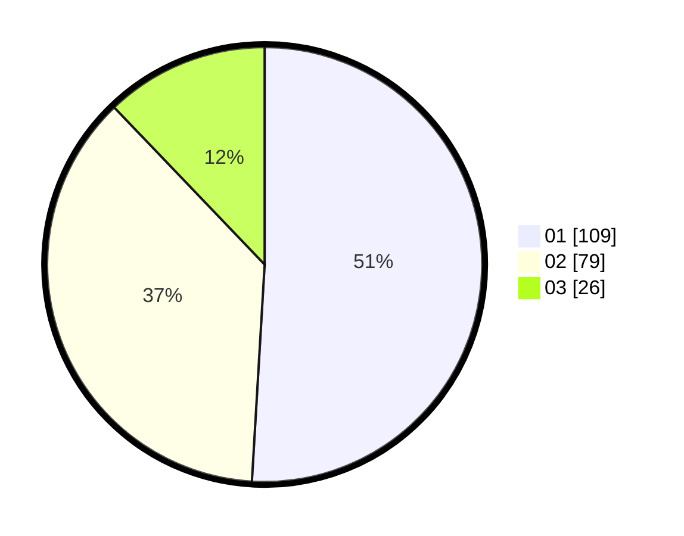

# Hasil

Hasil perolehan suara paslon dapat dilihat pada file paslon-01.txt, paslon-02.txt, dan paslon-03.txt.

Jika tidak ada, artinya data tersebut belum ada pada SIREKAP.

## Perolehan Suara

 * Paslon 01: **109**.
 * Paslon 02: **79**.
 * Paslon 03: **26**.

## Foto C Plano

https://sirekap-obj-formc.kpu.go.id/54fb/pemilu/ppwp/31/75/04/10/07/3175041007024-20240215-013300--f1005de3-9d75-47c0-b9e9-b47fcfa6cb8b.jpg

https://sirekap-obj-formc.kpu.go.id/54fb/pemilu/ppwp/31/75/04/10/07/3175041007024-20240215-013447--bf2549ca-7572-4270-bf4b-0f4d013429ea.jpg

https://sirekap-obj-formc.kpu.go.id/54fb/pemilu/ppwp/31/75/04/10/07/3175041007024-20240215-013534--e265420c-ddc0-4d29-89b1-ba44f5d27218.jpg

## DATA PEMILIH TETAP

Jumlah pemilih dalam DPT: **288**.
 * L: **155**.
 * P: **133**.

## DATA PENGGUNA HAK PILIH

Jumlah pengguna hak pilih dalam DPT: **198**.
 * L: **98**.
 * P: **100**.

Jumlah pengguna hak pilih dalam DPTb: **9**.
 * L: **5**.
 * P: **4**.

Jumlah pengguna hak pilih dalam DPK: **8**.
 * L: **5**.
 * P: **3**.

Jumlah pengguna hak pilih: **215**.
 * L: **108**.
 * P: **107**.

## JUMLAH SUARA SAH DAN TIDAK SAH

JUMLAH SELURUH SUARA SAH: **214**.

JUMLAH SUARA TIDAK SAH: **1**.

JUMLAH SELURUH SUARA SAH DAN SUARA TIDAK SAH: **215**.
