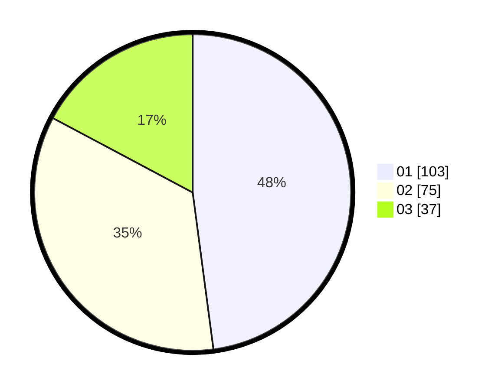

# Hasil

Hasil perolehan suara paslon dapat dilihat pada file paslon-01.txt, paslon-02.txt, dan paslon-03.txt.

Jika tidak ada, artinya data tersebut belum ada pada SIREKAP.

## Perolehan Suara

 * Paslon 01: **103**.
 * Paslon 02: **75**.
 * Paslon 03: **37**.

## Foto C Plano

https://sirekap-obj-formc.kpu.go.id/a11f/pemilu/ppwp/31/75/04/10/07/3175041007025-20240214-212343--a6cd378d-2f83-4a38-9655-cd23e0728f30.jpg

https://sirekap-obj-formc.kpu.go.id/a11f/pemilu/ppwp/31/75/04/10/07/3175041007025-20240214-212625--3fe42de1-4e08-475b-835e-b871186d55b5.jpg

https://sirekap-obj-formc.kpu.go.id/a11f/pemilu/ppwp/31/75/04/10/07/3175041007025-20240214-212822--73c0caa5-2b80-4afc-a0c5-58997ecca9f3.jpg
