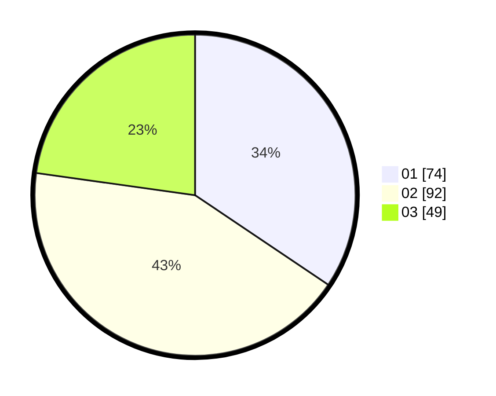

# Hasil

Hasil perolehan suara paslon dapat dilihat pada file paslon-01.txt, paslon-02.txt, dan paslon-03.txt.

Jika tidak ada, artinya data tersebut belum ada pada SIREKAP.

## Perolehan Suara

 * Paslon 01: **74**.
 * Paslon 02: **92**.
 * Paslon 03: **49**.

## Foto C Plano

https://sirekap-obj-formc.kpu.go.id/5259/pemilu/ppwp/31/75/04/10/07/3175041007027-20240214-155306--8221c219-ca2f-43cd-bb19-2316e9f4fd8b.jpg

https://sirekap-obj-formc.kpu.go.id/5259/pemilu/ppwp/31/75/04/10/07/3175041007027-20240214-184858--113dedb1-064c-40dc-84a6-11ae990ce10c.jpg

https://sirekap-obj-formc.kpu.go.id/5259/pemilu/ppwp/31/75/04/10/07/3175041007027-20240214-155726--a9a49557-096e-4909-bfea-63464a51000e.jpg

## DATA PEMILIH TETAP

Jumlah pemilih dalam DPT: **283**.
 * L: **132**.
 * P: **151**.

## DATA PENGGUNA HAK PILIH

Jumlah pengguna hak pilih dalam DPT: **214**.
 * L: **94**.
 * P: **120**.

Jumlah pengguna hak pilih dalam DPTb: **0**.
 * L: **0**.
 * P: **0**.

Jumlah pengguna hak pilih dalam DPK: **7**.
 * L: **3**.
 * P: **4**.

Jumlah pengguna hak pilih: **221**.
 * L: **97**.
 * P: **124**.

## JUMLAH SUARA SAH DAN TIDAK SAH

JUMLAH SELURUH SUARA SAH: **215**.

JUMLAH SUARA TIDAK SAH: **6**.

JUMLAH SELURUH SUARA SAH DAN SUARA TIDAK SAH: **221**.
