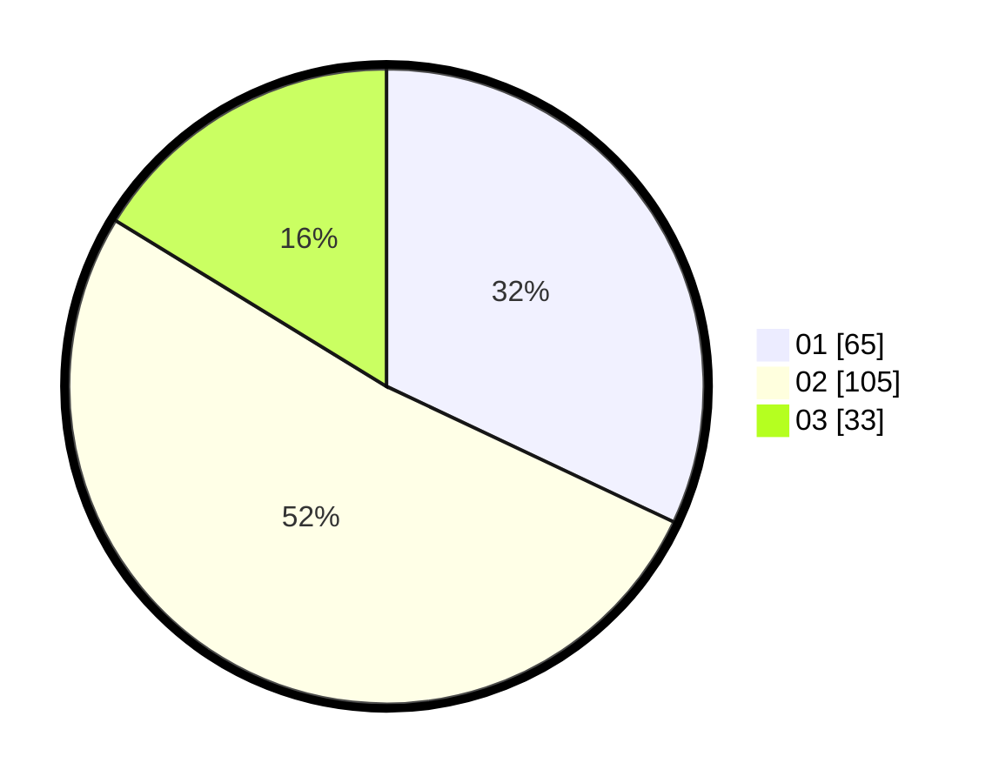

# Hasil

Hasil perolehan suara paslon dapat dilihat pada file paslon-01.txt, paslon-02.txt, dan paslon-03.txt.

Jika tidak ada, artinya data tersebut belum ada pada SIREKAP.

## Perolehan Suara

 * Paslon 01: **65**.
 * Paslon 02: **105**.
 * Paslon 03: **33**.

## Foto C Plano

https://sirekap-obj-formc.kpu.go.id/b545/pemilu/ppwp/31/75/04/10/07/3175041007032-20240215-221123--74b2303a-0dba-4b9c-bb88-ac967961449c.jpg

https://sirekap-obj-formc.kpu.go.id/b545/pemilu/ppwp/31/75/04/10/07/3175041007032-20240215-221125--bcbc5ba2-3146-44ee-b8b2-1ec6c7727265.jpg

https://sirekap-obj-formc.kpu.go.id/b545/pemilu/ppwp/31/75/04/10/07/3175041007032-20240215-221125--3e239707-73a1-4216-9022-041e801a7ccf.jpg

## DATA PEMILIH TETAP

Jumlah pemilih dalam DPT: **284**.
 * L: **143**.
 * P: **141**.

## DATA PENGGUNA HAK PILIH

Jumlah pengguna hak pilih dalam DPT: **197**.
 * L: **90**.
 * P: **107**.

Jumlah pengguna hak pilih dalam DPTb: **3**.
 * L: **1**.
 * P: **2**.

Jumlah pengguna hak pilih dalam DPK: **4**.
 * L: **3**.
 * P: **1**.

Jumlah pengguna hak pilih: **204**.
 * L: **94**.
 * P: **110**.

## JUMLAH SUARA SAH DAN TIDAK SAH

JUMLAH SELURUH SUARA SAH: **203**.

JUMLAH SUARA TIDAK SAH: **1**.

JUMLAH SELURUH SUARA SAH DAN SUARA TIDAK SAH: **204**.
