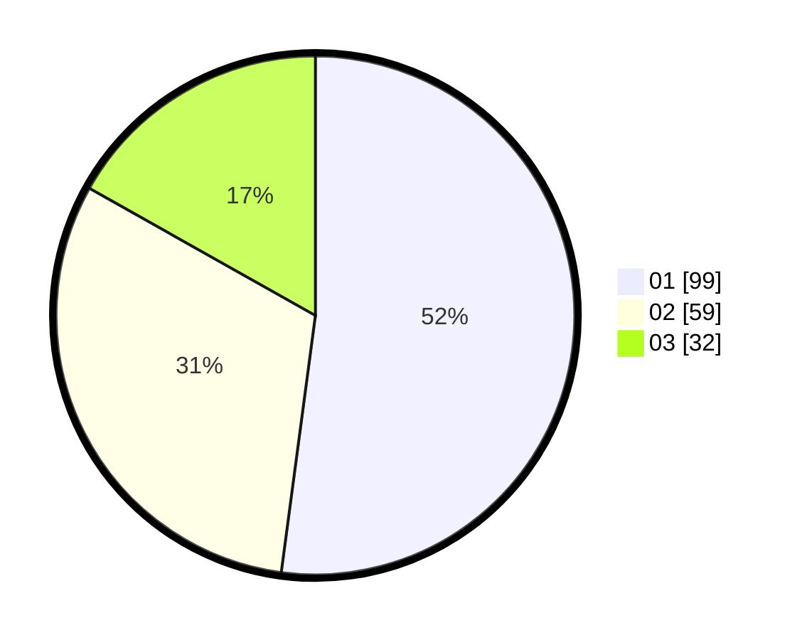

# Hasil

Hasil perolehan suara paslon dapat dilihat pada file paslon-01.txt, paslon-02.txt, dan paslon-03.txt.

Jika tidak ada, artinya data tersebut belum ada pada SIREKAP.

## Perolehan Suara

 * Paslon 01: **99**.
 * Paslon 02: **59**.
 * Paslon 03: **32**.

## Foto C Plano

https://sirekap-obj-formc.kpu.go.id/4016/pemilu/ppwp/31/75/04/10/07/3175041007033-20240214-224653--b1f7302e-20ed-41ae-81a4-82a854b7d0a4.jpg

https://sirekap-obj-formc.kpu.go.id/4016/pemilu/ppwp/31/75/04/10/07/3175041007033-20240214-224759--4bdd3aa0-35b3-446f-8fd7-8b0cb109b893.jpg

https://sirekap-obj-formc.kpu.go.id/4016/pemilu/ppwp/31/75/04/10/07/3175041007033-20240214-224845--1ef57507-5886-48c1-afc3-bbb879c5f110.jpg
