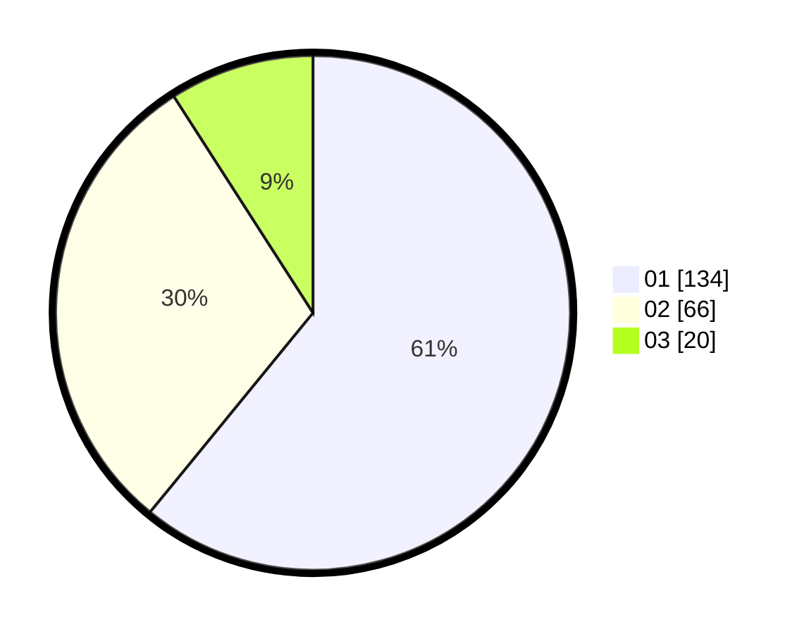

# Hasil

Hasil perolehan suara paslon dapat dilihat pada file paslon-01.txt, paslon-02.txt, dan paslon-03.txt.

Jika tidak ada, artinya data tersebut belum ada pada SIREKAP.

## Perolehan Suara

 * Paslon 01: **134**.
 * Paslon 02: **66**.
 * Paslon 03: **20**.

## Foto C Plano

https://sirekap-obj-formc.kpu.go.id/d199/pemilu/ppwp/31/75/04/10/07/3175041007035-20240216-151701--d9afee84-66ec-43ed-b61f-c069eeb9303a.jpg

https://sirekap-obj-formc.kpu.go.id/d199/pemilu/ppwp/31/75/04/10/07/3175041007035-20240216-151702--ebbca4ab-8b92-49b4-a12d-122b4dacd392.jpg

https://sirekap-obj-formc.kpu.go.id/d199/pemilu/ppwp/31/75/04/10/07/3175041007035-20240216-151701--f1e99c41-3246-4a1a-8700-96c1c3e37d92.jpg

## DATA PEMILIH TETAP

Jumlah pemilih dalam DPT: **263**.
 * L: **135**.
 * P: **128**.

## DATA PENGGUNA HAK PILIH

Jumlah pengguna hak pilih dalam DPT: **219**.
 * L: **107**.
 * P: **112**.

Jumlah pengguna hak pilih dalam DPTb: **3**.
 * L: **2**.
 * P: **1**.

Jumlah pengguna hak pilih dalam DPK: **1**.
 * L: **0**.
 * P: **1**.

Jumlah pengguna hak pilih: **223**.
 * L: **109**.
 * P: **114**.

## JUMLAH SUARA SAH DAN TIDAK SAH

JUMLAH SELURUH SUARA SAH: **220**.

JUMLAH SUARA TIDAK SAH: **4**.

JUMLAH SELURUH SUARA SAH DAN SUARA TIDAK SAH: **224**.
