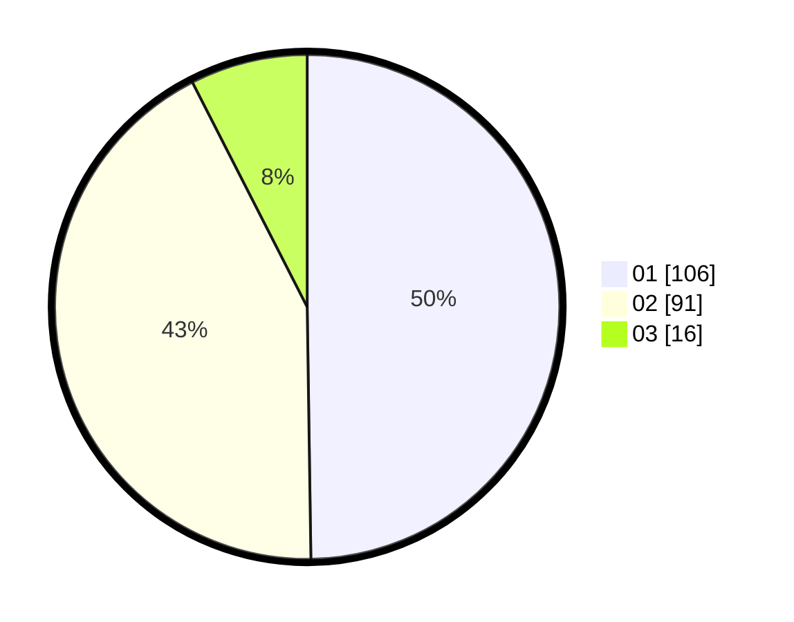

# Hasil

Hasil perolehan suara paslon dapat dilihat pada file paslon-01.txt, paslon-02.txt, dan paslon-03.txt.

Jika tidak ada, artinya data tersebut belum ada pada SIREKAP.

## Perolehan Suara

 * Paslon 01: **106**.
 * Paslon 02: **91**.
 * Paslon 03: **16**.

## Foto C Plano

https://sirekap-obj-formc.kpu.go.id/20d0/pemilu/ppwp/31/75/04/10/07/3175041007036-20240214-214923--b30c8ae5-0e4b-4f0a-9f4f-f75634f4f3e9.jpg

https://sirekap-obj-formc.kpu.go.id/20d0/pemilu/ppwp/31/75/04/10/07/3175041007036-20240214-214935--ba975931-9aea-4ce9-8f8c-703e62120538.jpg

https://sirekap-obj-formc.kpu.go.id/20d0/pemilu/ppwp/31/75/04/10/07/3175041007036-20240214-214946--bb77e31c-2d67-4a11-ae5e-f995b4bb0d82.jpg
