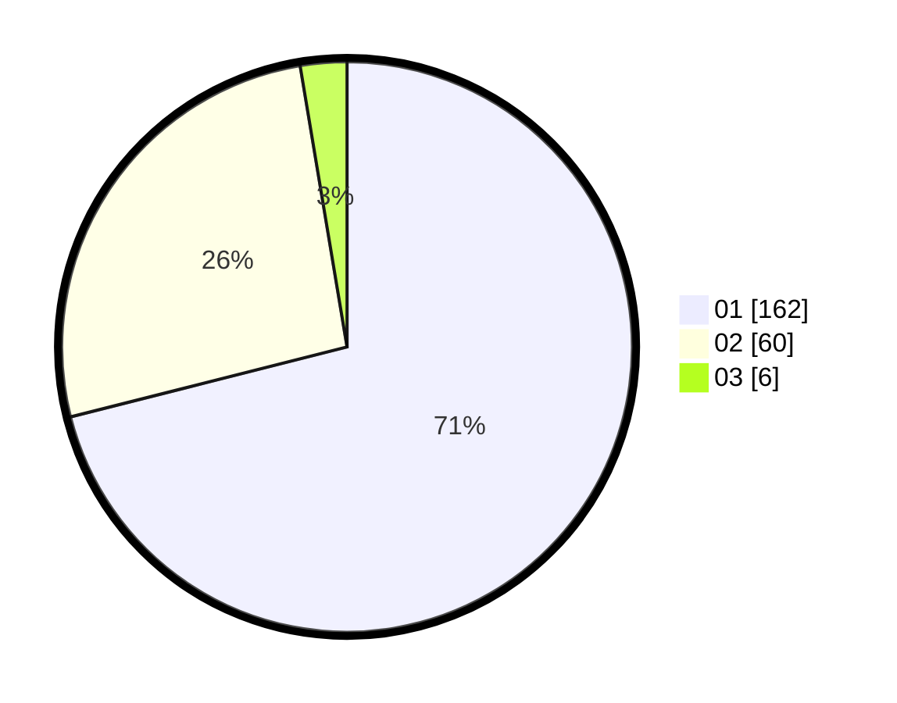

# Hasil

Hasil perolehan suara paslon dapat dilihat pada file paslon-01.txt, paslon-02.txt, dan paslon-03.txt.

Jika tidak ada, artinya data tersebut belum ada pada SIREKAP.

## Perolehan Suara

 * Paslon 01: **162**.
 * Paslon 02: **60**.
 * Paslon 03: **6**.

## Foto C Plano

https://sirekap-obj-formc.kpu.go.id/8c9d/pemilu/ppwp/31/75/04/10/07/3175041007038-20240215-000221--780020ea-6398-4da8-8034-1798060b656f.jpg

https://sirekap-obj-formc.kpu.go.id/8c9d/pemilu/ppwp/31/75/04/10/07/3175041007038-20240215-000206--66c28b24-3e3a-4db4-ab53-d90457069e00.jpg

https://sirekap-obj-formc.kpu.go.id/8c9d/pemilu/ppwp/31/75/04/10/07/3175041007038-20240215-000352--109e07f4-d54d-4f6c-b106-6393f3bfaa43.jpg
