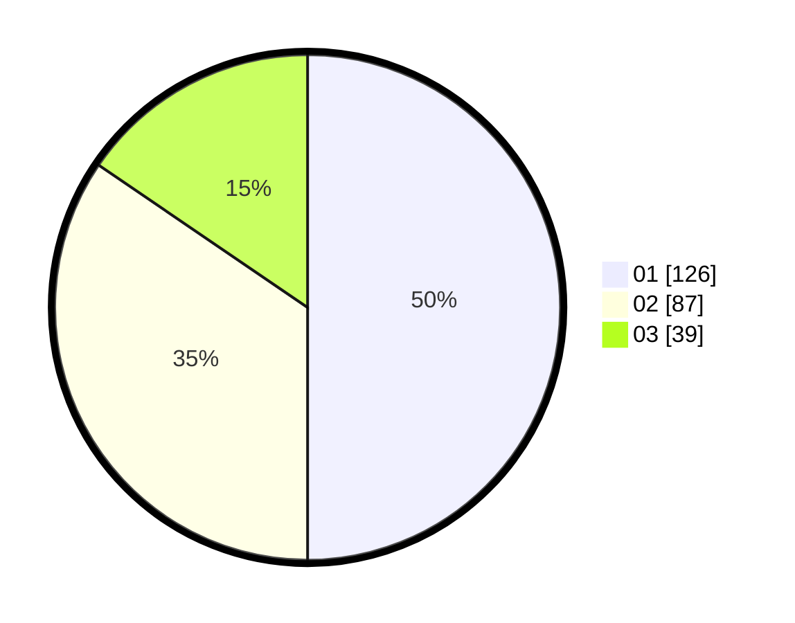

# Hasil

Hasil perolehan suara paslon dapat dilihat pada file paslon-01.txt, paslon-02.txt, dan paslon-03.txt.

Jika tidak ada, artinya data tersebut belum ada pada SIREKAP.

## Perolehan Suara

 * Paslon 01: **126**.
 * Paslon 02: **87**.
 * Paslon 03: **39**.

## Foto C Plano

https://sirekap-obj-formc.kpu.go.id/1abd/pemilu/ppwp/31/75/04/10/07/3175041007043-20240217-111303--5393a666-7b57-42ed-84b4-3c16d5851d5c.jpg

https://sirekap-obj-formc.kpu.go.id/1abd/pemilu/ppwp/31/75/04/10/07/3175041007043-20240217-130527--097746a8-8b07-436c-906a-8eec6ab89a4c.jpg

https://sirekap-obj-formc.kpu.go.id/1abd/pemilu/ppwp/31/75/04/10/07/3175041007043-20240217-130831--c17ca2c1-affc-4542-b83b-217a46e8d623.jpg

## DATA PEMILIH TETAP

Jumlah pemilih dalam DPT: **286**.
 * L: **142**.
 * P: **144**.

## DATA PENGGUNA HAK PILIH

Jumlah pengguna hak pilih dalam DPT: **238**.
 * L: **114**.
 * P: **124**.

Jumlah pengguna hak pilih dalam DPTb: **11**.
 * L: **5**.
 * P: **6**.

Jumlah pengguna hak pilih dalam DPK: **5**.
 * L: **0**.
 * P: **5**.

Jumlah pengguna hak pilih: **254**.
 * L: **119**.
 * P: **135**.

## JUMLAH SUARA SAH DAN TIDAK SAH

JUMLAH SELURUH SUARA SAH: **252**.

JUMLAH SUARA TIDAK SAH: **2**.

JUMLAH SELURUH SUARA SAH DAN SUARA TIDAK SAH: **254**.
