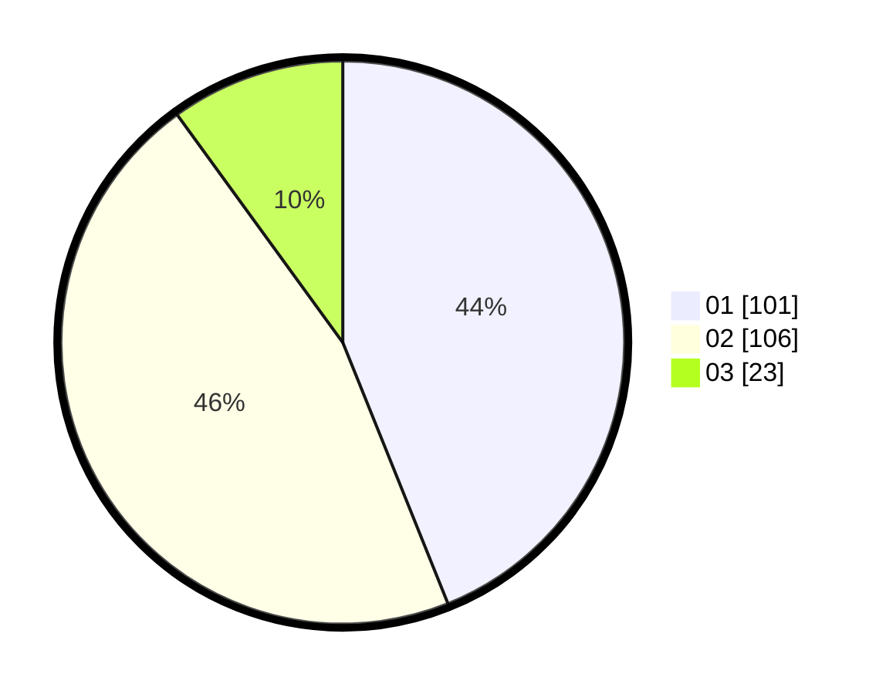

# Hasil

Hasil perolehan suara paslon dapat dilihat pada file paslon-01.txt, paslon-02.txt, dan paslon-03.txt.

Jika tidak ada, artinya data tersebut belum ada pada SIREKAP.

## Perolehan Suara

 * Paslon 01: **101**.
 * Paslon 02: **106**.
 * Paslon 03: **23**.

## Foto C Plano

https://sirekap-obj-formc.kpu.go.id/ce11/pemilu/ppwp/31/75/04/10/07/3175041007044-20240214-215751--4060e78d-c6b3-48dd-8376-4768a0f8eb6d.jpg

https://sirekap-obj-formc.kpu.go.id/ce11/pemilu/ppwp/31/75/04/10/07/3175041007044-20240214-215837--bab5c965-341a-4007-80e8-6b39cc2e8b4a.jpg

https://sirekap-obj-formc.kpu.go.id/ce11/pemilu/ppwp/31/75/04/10/07/3175041007044-20240214-220117--827053e5-0d88-4d37-a3b7-66111bbb3ad7.jpg
