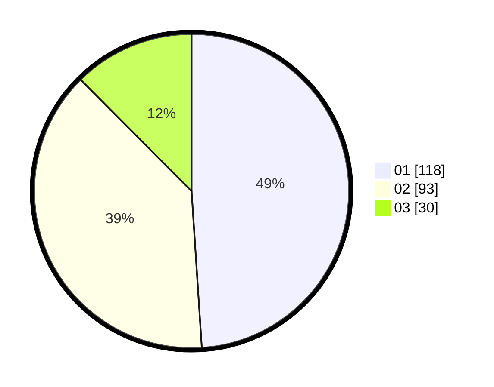

# Hasil

Hasil perolehan suara paslon dapat dilihat pada file paslon-01.txt, paslon-02.txt, dan paslon-03.txt.

Jika tidak ada, artinya data tersebut belum ada pada SIREKAP.

## Perolehan Suara

 * Paslon 01: **118**.
 * Paslon 02: **93**.
 * Paslon 03: **30**.

## Foto C Plano

https://sirekap-obj-formc.kpu.go.id/64c8/pemilu/ppwp/31/75/04/10/07/3175041007047-20240214-222431--4b71f075-d7a1-444e-9934-52314b254f2b.jpg

https://sirekap-obj-formc.kpu.go.id/64c8/pemilu/ppwp/31/75/04/10/07/3175041007047-20240214-222541--c82d9a9e-2a26-4f11-b511-ca111e63fd74.jpg

https://sirekap-obj-formc.kpu.go.id/64c8/pemilu/ppwp/31/75/04/10/07/3175041007047-20240214-222645--d316048e-0523-4043-94d5-d67c48341706.jpg

## DATA PEMILIH TETAP

Jumlah pemilih dalam DPT: **288**.
 * L: **146**.
 * P: **142**.

## DATA PENGGUNA HAK PILIH

Jumlah pengguna hak pilih dalam DPT: **230**.
 * L: **114**.
 * P: **116**.

Jumlah pengguna hak pilih dalam DPTb: **11**.
 * L: **2**.
 * P: **9**.

Jumlah pengguna hak pilih dalam DPK: **0**.
 * L: **0**.
 * P: **0**.

Jumlah pengguna hak pilih: **241**.
 * L: **116**.
 * P: **125**.

## JUMLAH SUARA SAH DAN TIDAK SAH

JUMLAH SELURUH SUARA SAH: **241**.

JUMLAH SUARA TIDAK SAH: **0**.

JUMLAH SELURUH SUARA SAH DAN SUARA TIDAK SAH: **241**.
