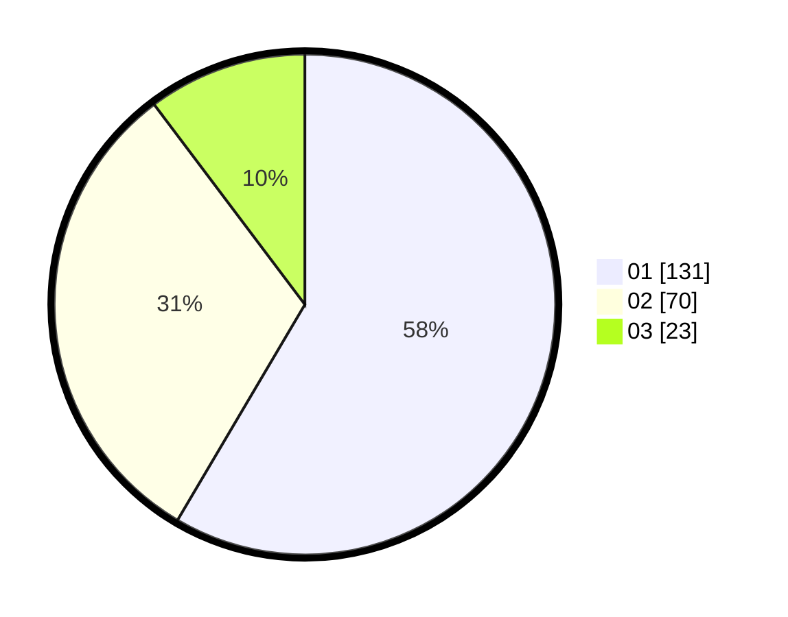

# Hasil

Hasil perolehan suara paslon dapat dilihat pada file paslon-01.txt, paslon-02.txt, dan paslon-03.txt.

Jika tidak ada, artinya data tersebut belum ada pada SIREKAP.

## Perolehan Suara

 * Paslon 01: **131**.
 * Paslon 02: **70**.
 * Paslon 03: **23**.

## Foto C Plano

https://sirekap-obj-formc.kpu.go.id/d4b7/pemilu/ppwp/31/75/04/10/07/3175041007050-20240215-215949--22fd8682-a219-46cf-9cdc-42b3a0d2b763.jpg

https://sirekap-obj-formc.kpu.go.id/d4b7/pemilu/ppwp/31/75/04/10/07/3175041007050-20240215-215952--c4deac3f-ce19-4b27-9f38-c05e9c538e89.jpg

https://sirekap-obj-formc.kpu.go.id/d4b7/pemilu/ppwp/31/75/04/10/07/3175041007050-20240215-215950--1dafabe5-f255-43ad-93ee-972d03711e77.jpg

## DATA PEMILIH TETAP

Jumlah pemilih dalam DPT: **275**.
 * L: **133**.
 * P: **142**.

## DATA PENGGUNA HAK PILIH

Jumlah pengguna hak pilih dalam DPT: **217**.
 * L: **103**.
 * P: **114**.

Jumlah pengguna hak pilih dalam DPTb: **3**.
 * L: **0**.
 * P: **3**.

Jumlah pengguna hak pilih dalam DPK: **4**.
 * L: **1**.
 * P: **3**.

Jumlah pengguna hak pilih: **224**.
 * L: **104**.
 * P: **120**.

## JUMLAH SUARA SAH DAN TIDAK SAH

JUMLAH SELURUH SUARA SAH: **224**.

JUMLAH SUARA TIDAK SAH: **0**.

JUMLAH SELURUH SUARA SAH DAN SUARA TIDAK SAH: **224**.
