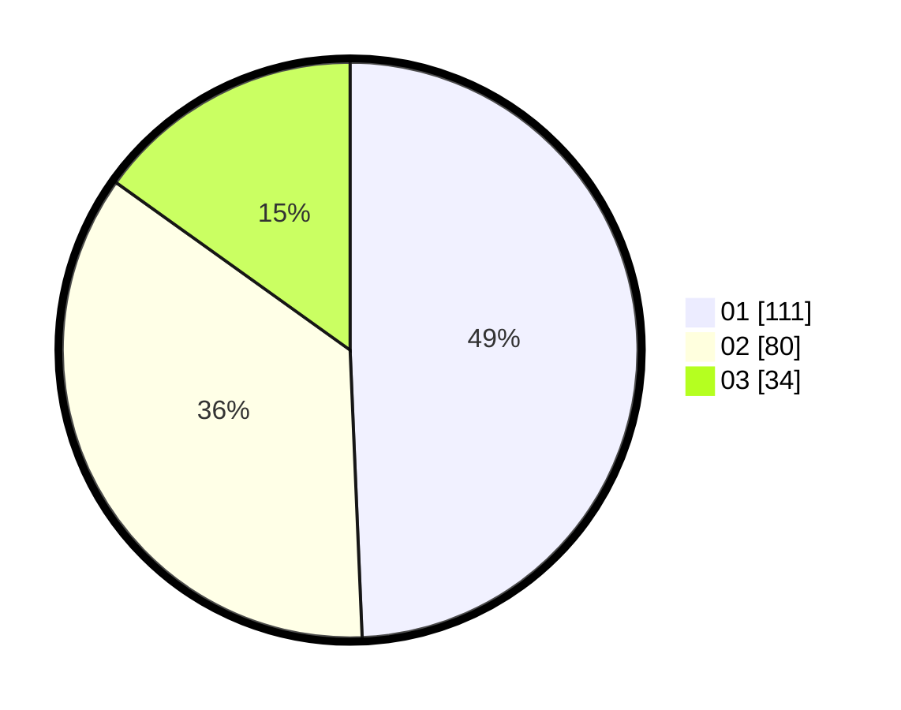

# Hasil

Hasil perolehan suara paslon dapat dilihat pada file paslon-01.txt, paslon-02.txt, dan paslon-03.txt.

Jika tidak ada, artinya data tersebut belum ada pada SIREKAP.

## Perolehan Suara

 * Paslon 01: **111**.
 * Paslon 02: **80**.
 * Paslon 03: **34**.

## Foto C Plano

https://sirekap-obj-formc.kpu.go.id/5ea6/pemilu/ppwp/31/75/04/10/07/3175041007051-20240214-212802--80de5c4f-08b2-4161-adf6-2e7b3b727b33.jpg

https://sirekap-obj-formc.kpu.go.id/5ea6/pemilu/ppwp/31/75/04/10/07/3175041007051-20240214-212841--920bea26-9c41-4e77-95e4-32cf89558854.jpg

https://sirekap-obj-formc.kpu.go.id/5ea6/pemilu/ppwp/31/75/04/10/07/3175041007051-20240214-215223--5b803bdd-0921-495a-b07d-2e8ab537ba0c.jpg
