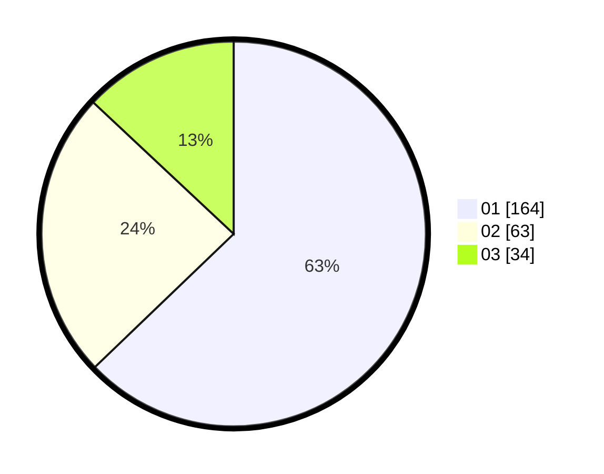

# Hasil

Hasil perolehan suara paslon dapat dilihat pada file paslon-01.txt, paslon-02.txt, dan paslon-03.txt.

Jika tidak ada, artinya data tersebut belum ada pada SIREKAP.

## Perolehan Suara

 * Paslon 01: **164**.
 * Paslon 02: **63**.
 * Paslon 03: **34**.

## Foto C Plano

https://sirekap-obj-formc.kpu.go.id/203f/pemilu/ppwp/31/75/04/10/07/3175041007060-20240216-153525--ef83e2bd-ce79-489f-9d87-772ec0902de3.jpg

https://sirekap-obj-formc.kpu.go.id/203f/pemilu/ppwp/31/75/04/10/07/3175041007060-20240216-153527--464be9f5-746f-46df-af7d-c802b5031830.jpg

https://sirekap-obj-formc.kpu.go.id/203f/pemilu/ppwp/31/75/04/10/07/3175041007060-20240216-153526--70adeb00-8c87-4b37-92f6-9fa7c2d88d18.jpg

## DATA PEMILIH TETAP

Jumlah pemilih dalam DPT: **291**.
 * L: **149**.
 * P: **142**.

## DATA PENGGUNA HAK PILIH

Jumlah pengguna hak pilih dalam DPT: **255**.
 * L: **129**.
 * P: **126**.

Jumlah pengguna hak pilih dalam DPTb: **9**.
 * L: **9**.
 * P: **0**.

Jumlah pengguna hak pilih dalam DPK: **1**.
 * L: **0**.
 * P: **1**.

Jumlah pengguna hak pilih: **265**.
 * L: **138**.
 * P: **127**.

## JUMLAH SUARA SAH DAN TIDAK SAH

JUMLAH SELURUH SUARA SAH: **261**.

JUMLAH SUARA TIDAK SAH: **4**.

JUMLAH SELURUH SUARA SAH DAN SUARA TIDAK SAH: **265**.
