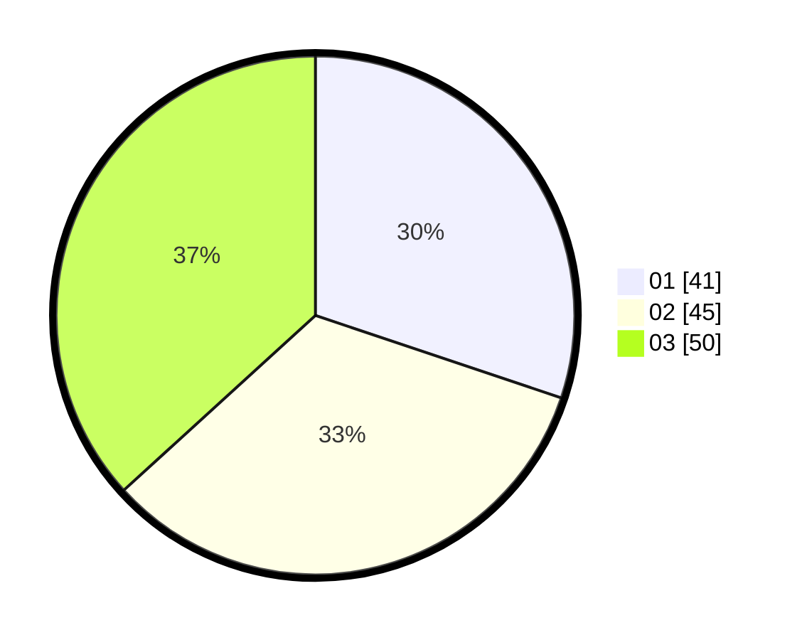

# Hasil

Hasil perolehan suara paslon dapat dilihat pada file paslon-01.txt, paslon-02.txt, dan paslon-03.txt.

Jika tidak ada, artinya data tersebut belum ada pada SIREKAP.

## Perolehan Suara

 * Paslon 01: **41**.
 * Paslon 02: **45**.
 * Paslon 03: **50**.

## Foto C Plano

https://sirekap-obj-formc.kpu.go.id/2a37/pemilu/ppwp/31/75/04/10/07/3175041007061-20240216-200534--9e79b07e-7a0b-4b48-a0c5-c0cf2a580096.jpg

https://sirekap-obj-formc.kpu.go.id/2a37/pemilu/ppwp/31/75/04/10/07/3175041007061-20240216-200629--a633dfc0-4396-47ad-a6e7-36f8668b435c.jpg

https://sirekap-obj-formc.kpu.go.id/2a37/pemilu/ppwp/31/75/04/10/07/3175041007061-20240216-200712--56343d99-7560-428b-abf8-064be23add51.jpg

## DATA PEMILIH TETAP

Jumlah pemilih dalam DPT: **280**.
 * L: **134**.
 * P: **146**.

## DATA PENGGUNA HAK PILIH

Jumlah pengguna hak pilih dalam DPT: **241**.
 * L: **111**.
 * P: **130**.

Jumlah pengguna hak pilih dalam DPTb: **0**.
 * L: **0**.
 * P: **0**.

Jumlah pengguna hak pilih dalam DPK: **0**.
 * L: **0**.
 * P: **0**.

Jumlah pengguna hak pilih: **241**.
 * L: **111**.
 * P: **130**.

## JUMLAH SUARA SAH DAN TIDAK SAH

JUMLAH SELURUH SUARA SAH: **238**.

JUMLAH SUARA TIDAK SAH: **3**.

JUMLAH SELURUH SUARA SAH DAN SUARA TIDAK SAH: **241**.
