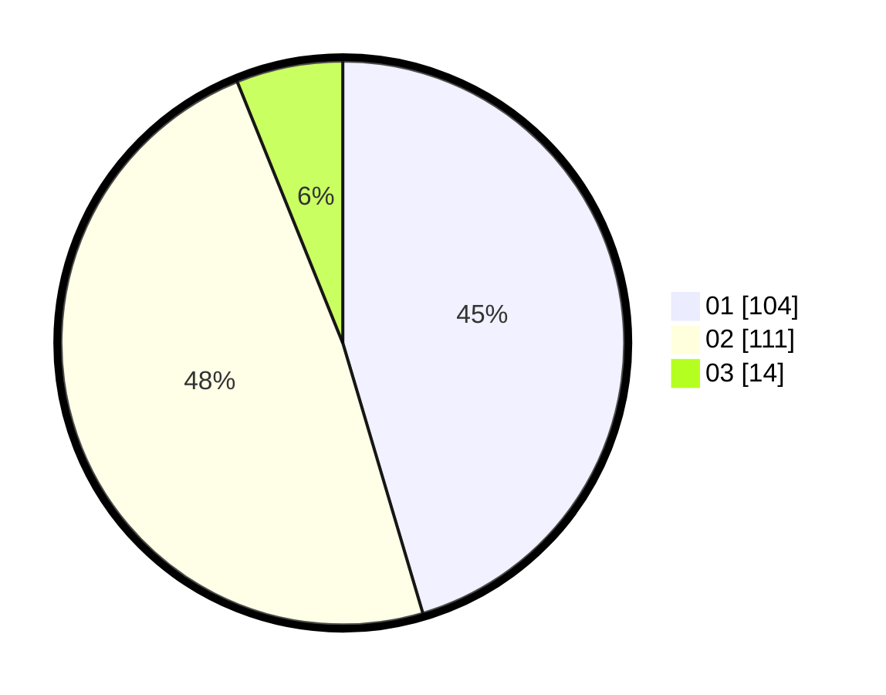

# Hasil

Hasil perolehan suara paslon dapat dilihat pada file paslon-01.txt, paslon-02.txt, dan paslon-03.txt.

Jika tidak ada, artinya data tersebut belum ada pada SIREKAP.

## Perolehan Suara

 * Paslon 01: **104**.
 * Paslon 02: **111**.
 * Paslon 03: **14**.

## Foto C Plano

https://sirekap-obj-formc.kpu.go.id/c88d/pemilu/ppwp/31/75/04/10/07/3175041007063-20240215-211341--ba40e47f-5abe-40c6-9611-0ee355af15c5.jpg

https://sirekap-obj-formc.kpu.go.id/c88d/pemilu/ppwp/31/75/04/10/07/3175041007063-20240214-233627--b879a7db-11ac-4383-ae1e-ec6dd4a19c10.jpg
