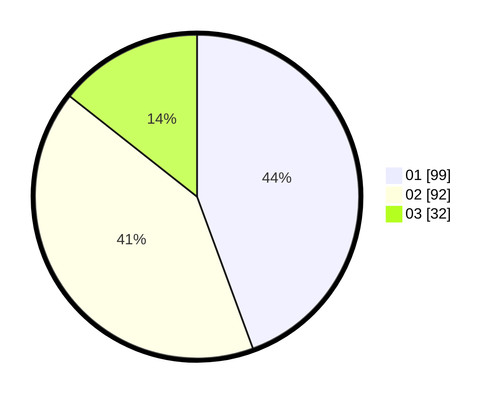

# Hasil

Hasil perolehan suara paslon dapat dilihat pada file paslon-01.txt, paslon-02.txt, dan paslon-03.txt.

Jika tidak ada, artinya data tersebut belum ada pada SIREKAP.

## Perolehan Suara

 * Paslon 01: **99**.
 * Paslon 02: **92**.
 * Paslon 03: **32**.

## Foto C Plano

https://sirekap-obj-formc.kpu.go.id/7ba0/pemilu/ppwp/31/75/04/10/07/3175041007071-20240214-191912--dc3a3ece-40b0-4882-a057-79d708f22629.jpg

https://sirekap-obj-formc.kpu.go.id/7ba0/pemilu/ppwp/31/75/04/10/07/3175041007071-20240214-190534--f8204866-7c99-467d-847c-b8deb03cec0b.jpg

https://sirekap-obj-formc.kpu.go.id/7ba0/pemilu/ppwp/31/75/04/10/07/3175041007071-20240214-194402--6fbd1ebe-3de1-40c8-bee5-c6590883a1e8.jpg

## DATA PEMILIH TETAP

Jumlah pemilih dalam DPT: **290**.
 * L: **139**.
 * P: **151**.

## DATA PENGGUNA HAK PILIH

Jumlah pengguna hak pilih dalam DPT: **225**.
 * L: **101**.
 * P: **124**.

Jumlah pengguna hak pilih dalam DPTb: **0**.
 * L: **0**.
 * P: **0**.

Jumlah pengguna hak pilih dalam DPK: **0**.
 * L: **0**.
 * P: **0**.

Jumlah pengguna hak pilih: **225**.
 * L: **101**.
 * P: **124**.

## JUMLAH SUARA SAH DAN TIDAK SAH

JUMLAH SELURUH SUARA SAH: **223**.

JUMLAH SUARA TIDAK SAH: **2**.

JUMLAH SELURUH SUARA SAH DAN SUARA TIDAK SAH: **225**.
