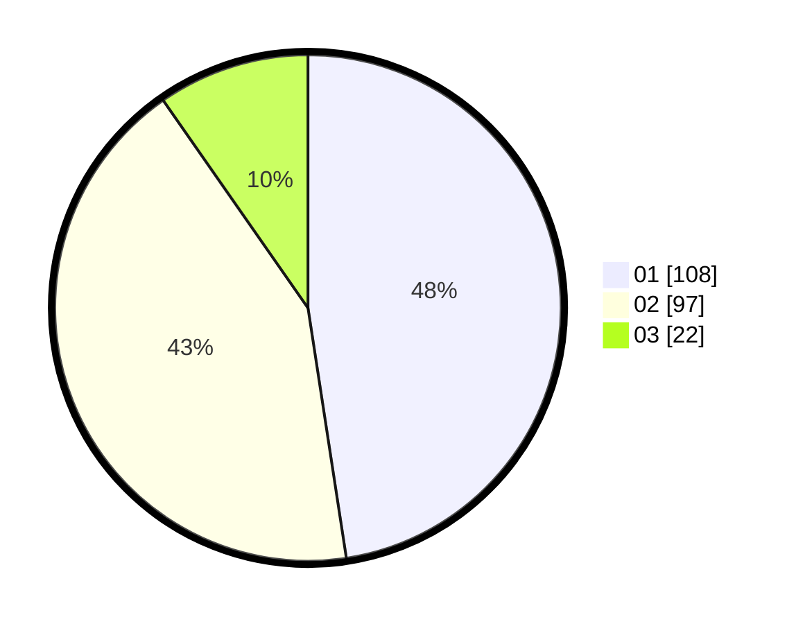

# Hasil

Hasil perolehan suara paslon dapat dilihat pada file paslon-01.txt, paslon-02.txt, dan paslon-03.txt.

Jika tidak ada, artinya data tersebut belum ada pada SIREKAP.

## Perolehan Suara

 * Paslon 01: **108**.
 * Paslon 02: **97**.
 * Paslon 03: **22**.

## Foto C Plano

https://sirekap-obj-formc.kpu.go.id/a2df/pemilu/ppwp/31/75/04/10/07/3175041007073-20240214-235124--6ed1e7f7-fdae-480f-b472-6408e929b86a.jpg

https://sirekap-obj-formc.kpu.go.id/a2df/pemilu/ppwp/31/75/04/10/07/3175041007073-20240214-235231--ab9d4d51-669d-4720-a356-a846f6591c7d.jpg
