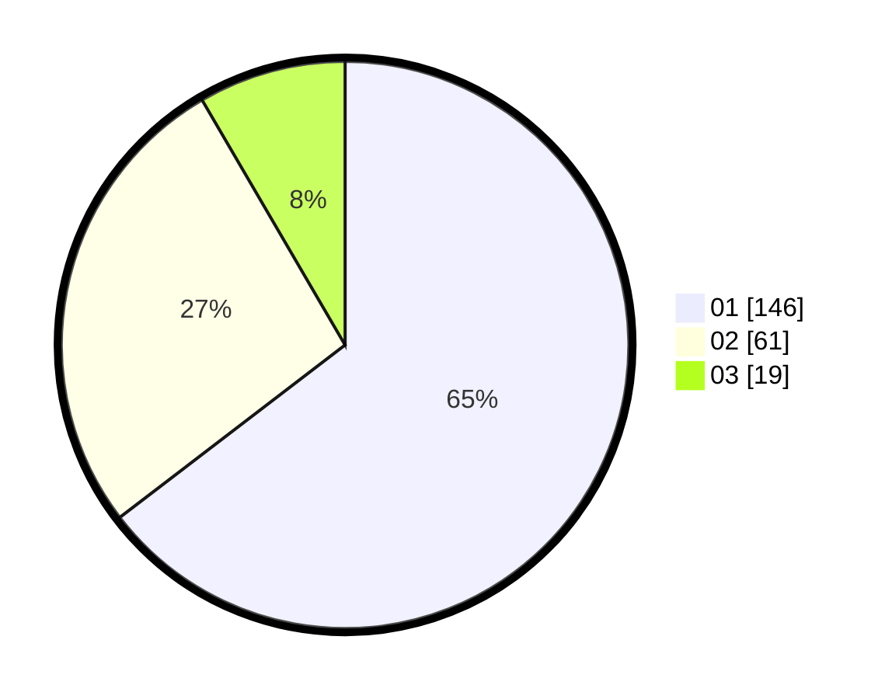

# Hasil

Hasil perolehan suara paslon dapat dilihat pada file paslon-01.txt, paslon-02.txt, dan paslon-03.txt.

Jika tidak ada, artinya data tersebut belum ada pada SIREKAP.

## Perolehan Suara

 * Paslon 01: **146**.
 * Paslon 02: **61**.
 * Paslon 03: **19**.

## Foto C Plano

https://sirekap-obj-formc.kpu.go.id/1e0b/pemilu/ppwp/31/75/04/10/07/3175041007081-20240214-185301--5f5cf9ca-f759-4a45-a7f1-6a89e4429fe3.jpg

https://sirekap-obj-formc.kpu.go.id/1e0b/pemilu/ppwp/31/75/04/10/07/3175041007081-20240214-185419--a6bc50f3-3c26-4acb-ae6c-c882a36f5e28.jpg

https://sirekap-obj-formc.kpu.go.id/1e0b/pemilu/ppwp/31/75/04/10/07/3175041007081-20240214-185509--f6728c39-4d2d-4de4-b1f6-a778a04c5b26.jpg

## DATA PEMILIH TETAP

Jumlah pemilih dalam DPT: **279**.
 * L: **129**.
 * P: **150**.

## DATA PENGGUNA HAK PILIH

Jumlah pengguna hak pilih dalam DPT: **217**.
 * L: **94**.
 * P: **123**.

Jumlah pengguna hak pilih dalam DPTb: **7**.
 * L: **3**.
 * P: **4**.

Jumlah pengguna hak pilih dalam DPK: **4**.
 * L: **3**.
 * P: **1**.

Jumlah pengguna hak pilih: **228**.
 * L: **100**.
 * P: **128**.

## JUMLAH SUARA SAH DAN TIDAK SAH

JUMLAH SELURUH SUARA SAH: **226**.

JUMLAH SUARA TIDAK SAH: **2**.

JUMLAH SELURUH SUARA SAH DAN SUARA TIDAK SAH: **228**.
