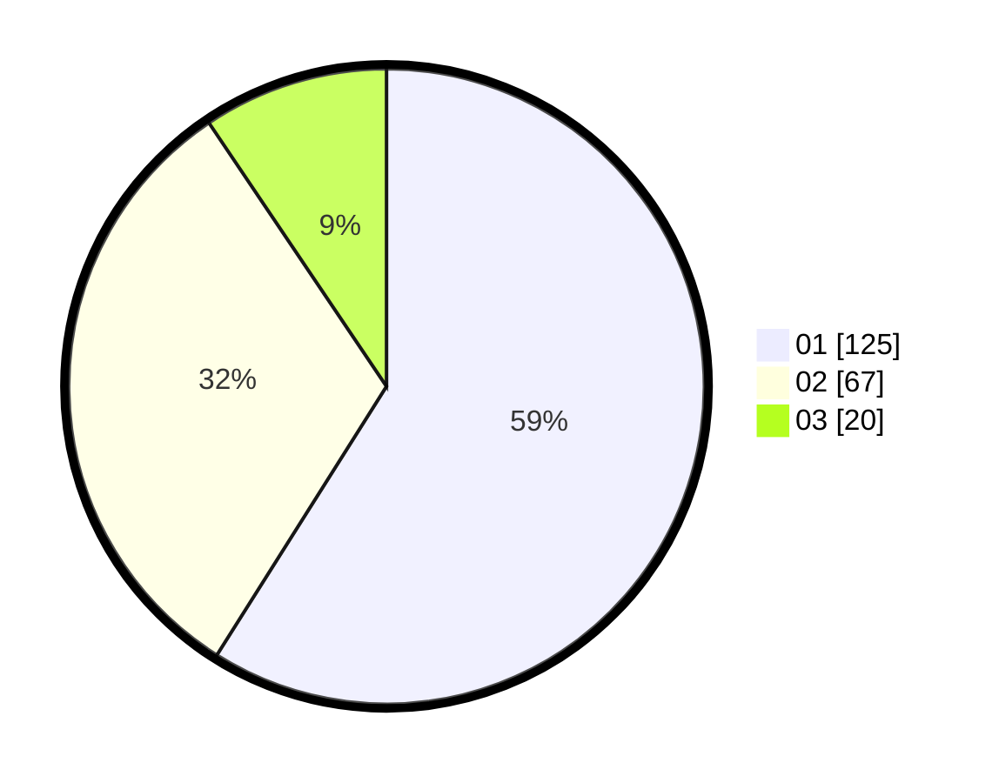

# Hasil

Hasil perolehan suara paslon dapat dilihat pada file paslon-01.txt, paslon-02.txt, dan paslon-03.txt.

Jika tidak ada, artinya data tersebut belum ada pada SIREKAP.

## Perolehan Suara

 * Paslon 01: **125**.
 * Paslon 02: **67**.
 * Paslon 03: **20**.

## Foto C Plano

https://sirekap-obj-formc.kpu.go.id/847e/pemilu/ppwp/31/75/04/10/07/3175041007082-20240214-185005--8d3f7caf-76a6-47a2-9804-f532a52e8ad2.jpg

https://sirekap-obj-formc.kpu.go.id/847e/pemilu/ppwp/31/75/04/10/07/3175041007082-20240214-185147--3f01a149-14ba-4588-9743-504ec12ea4d5.jpg

https://sirekap-obj-formc.kpu.go.id/847e/pemilu/ppwp/31/75/04/10/07/3175041007082-20240214-185327--e259217c-ecd8-4d31-ae19-aede8ce30685.jpg

## DATA PEMILIH TETAP

Jumlah pemilih dalam DPT: **277**.
 * L: **139**.
 * P: **138**.

## DATA PENGGUNA HAK PILIH

Jumlah pengguna hak pilih dalam DPT: **213**.
 * L: **101**.
 * P: **112**.

Jumlah pengguna hak pilih dalam DPTb: **0**.
 * L: **0**.
 * P: **0**.

Jumlah pengguna hak pilih dalam DPK: **1**.
 * L: **1**.
 * P: **0**.

Jumlah pengguna hak pilih: **214**.
 * L: **102**.
 * P: **112**.

## JUMLAH SUARA SAH DAN TIDAK SAH

JUMLAH SELURUH SUARA SAH: **212**.

JUMLAH SUARA TIDAK SAH: **2**.

JUMLAH SELURUH SUARA SAH DAN SUARA TIDAK SAH: **214**.
