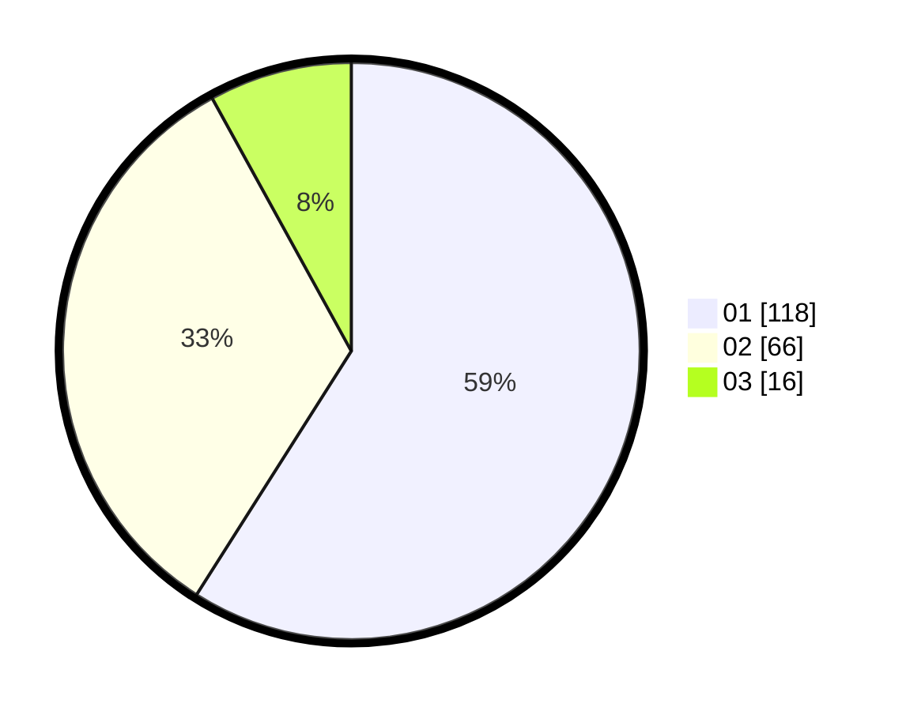

# Hasil

Hasil perolehan suara paslon dapat dilihat pada file paslon-01.txt, paslon-02.txt, dan paslon-03.txt.

Jika tidak ada, artinya data tersebut belum ada pada SIREKAP.

## Perolehan Suara

 * Paslon 01: **118**.
 * Paslon 02: **66**.
 * Paslon 03: **16**.

## Foto C Plano

https://sirekap-obj-formc.kpu.go.id/18c7/pemilu/ppwp/31/75/04/10/07/3175041007083-20240214-202040--f23fa050-f911-4f5a-96df-394244fe9c19.jpg

https://sirekap-obj-formc.kpu.go.id/18c7/pemilu/ppwp/31/75/04/10/07/3175041007083-20240214-202310--b2d52c54-acd9-4140-9371-4319ab52543b.jpg

https://sirekap-obj-formc.kpu.go.id/18c7/pemilu/ppwp/31/75/04/10/07/3175041007083-20240214-202608--fb08d66f-ba00-4ee8-a520-af437d2e5793.jpg

## DATA PEMILIH TETAP

Jumlah pemilih dalam DPT: **263**.
 * L: **139**.
 * P: **124**.

## DATA PENGGUNA HAK PILIH

Jumlah pengguna hak pilih dalam DPT: **201**.
 * L: **98**.
 * P: **103**.

Jumlah pengguna hak pilih dalam DPTb: **0**.
 * L: **0**.
 * P: **0**.

Jumlah pengguna hak pilih dalam DPK: **0**.
 * L: **0**.
 * P: **0**.

Jumlah pengguna hak pilih: **201**.
 * L: **98**.
 * P: **103**.

## JUMLAH SUARA SAH DAN TIDAK SAH

JUMLAH SELURUH SUARA SAH: **200**.

JUMLAH SUARA TIDAK SAH: **1**.

JUMLAH SELURUH SUARA SAH DAN SUARA TIDAK SAH: **201**.
