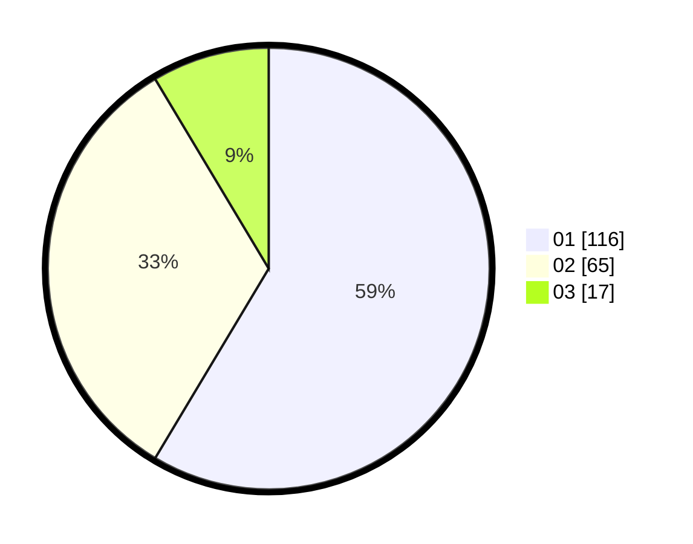

# Hasil

Hasil perolehan suara paslon dapat dilihat pada file paslon-01.txt, paslon-02.txt, dan paslon-03.txt.

Jika tidak ada, artinya data tersebut belum ada pada SIREKAP.

## Perolehan Suara

 * Paslon 01: **116**.
 * Paslon 02: **65**.
 * Paslon 03: **17**.

## Foto C Plano

https://sirekap-obj-formc.kpu.go.id/d158/pemilu/ppwp/31/75/04/10/07/3175041007084-20240216-065538--3196884c-cb0e-439c-8e3f-b7940d7b475b.jpg

https://sirekap-obj-formc.kpu.go.id/d158/pemilu/ppwp/31/75/04/10/07/3175041007084-20240216-065540--66d0c4e4-087c-49d6-90d6-a486ba1e2b31.jpg

https://sirekap-obj-formc.kpu.go.id/d158/pemilu/ppwp/31/75/04/10/07/3175041007084-20240216-065539--d961a121-aa8b-4bc7-a61f-46d8b13d5548.jpg

## DATA PEMILIH TETAP

Jumlah pemilih dalam DPT: **0**.
 * L: **0**.
 * P: **0**.

## DATA PENGGUNA HAK PILIH

Jumlah pengguna hak pilih dalam DPT: **0**.
 * L: **0**.
 * P: **0**.

Jumlah pengguna hak pilih dalam DPTb: **0**.
 * L: **0**.
 * P: **0**.

Jumlah pengguna hak pilih dalam DPK: **0**.
 * L: **0**.
 * P: **0**.

Jumlah pengguna hak pilih: **0**.
 * L: **0**.
 * P: **0**.

## JUMLAH SUARA SAH DAN TIDAK SAH

JUMLAH SELURUH SUARA SAH: **198**.

JUMLAH SUARA TIDAK SAH: **3**.

JUMLAH SELURUH SUARA SAH DAN SUARA TIDAK SAH: **201**.
