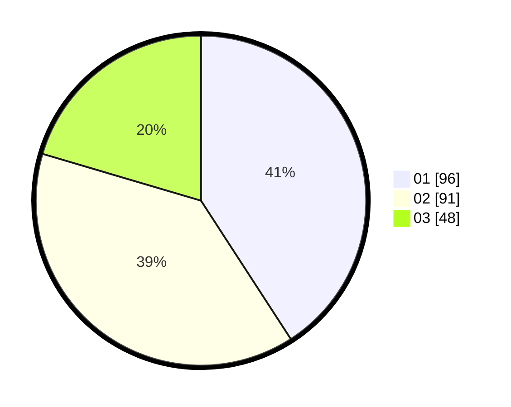

# Hasil

Hasil perolehan suara paslon dapat dilihat pada file paslon-01.txt, paslon-02.txt, dan paslon-03.txt.

Jika tidak ada, artinya data tersebut belum ada pada SIREKAP.

## Perolehan Suara

 * Paslon 01: **96**.
 * Paslon 02: **91**.
 * Paslon 03: **48**.

## Foto C Plano

https://sirekap-obj-formc.kpu.go.id/90c7/pemilu/ppwp/31/75/04/10/07/3175041007089-20240214-233655--189e0cfa-dc3e-4422-9b89-0ef703d51a1a.jpg

https://sirekap-obj-formc.kpu.go.id/90c7/pemilu/ppwp/31/75/04/10/07/3175041007089-20240214-233902--f78c9ac1-8d1e-41f1-9429-88e76924ce9d.jpg

https://sirekap-obj-formc.kpu.go.id/90c7/pemilu/ppwp/31/75/04/10/07/3175041007089-20240214-234056--83d89244-896d-43dc-9cf5-dbd527379e70.jpg
