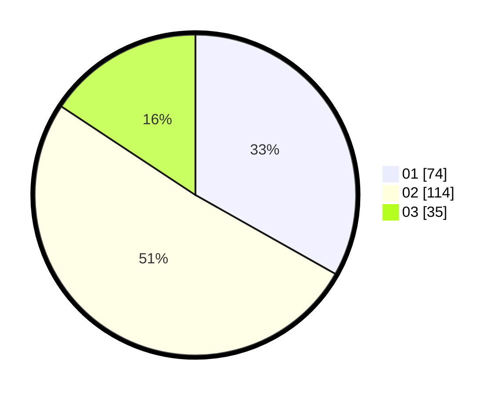

# Hasil

Hasil perolehan suara paslon dapat dilihat pada file paslon-01.txt, paslon-02.txt, dan paslon-03.txt.

Jika tidak ada, artinya data tersebut belum ada pada SIREKAP.

## Perolehan Suara

 * Paslon 01: **74**.
 * Paslon 02: **114**.
 * Paslon 03: **35**.

## Foto C Plano

https://sirekap-obj-formc.kpu.go.id/92ee/pemilu/ppwp/31/75/04/10/07/3175041007091-20240214-210214--2a7b2eb6-7b12-44c7-bf3a-2db463ed40cc.jpg

https://sirekap-obj-formc.kpu.go.id/92ee/pemilu/ppwp/31/75/04/10/07/3175041007091-20240214-210344--e57c003c-992c-473e-885d-5828c9479604.jpg

https://sirekap-obj-formc.kpu.go.id/92ee/pemilu/ppwp/31/75/04/10/07/3175041007091-20240214-210444--ac2d0cff-7477-409a-8bf1-d33ddb90141b.jpg
