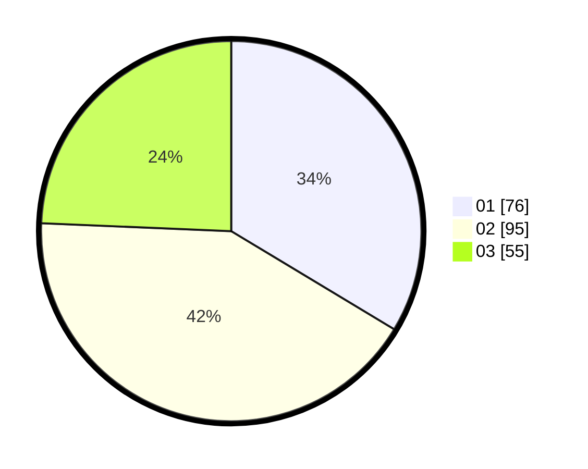

# Hasil

Hasil perolehan suara paslon dapat dilihat pada file paslon-01.txt, paslon-02.txt, dan paslon-03.txt.

Jika tidak ada, artinya data tersebut belum ada pada SIREKAP.

## Perolehan Suara

 * Paslon 01: **76**.
 * Paslon 02: **95**.
 * Paslon 03: **55**.

## Foto C Plano

https://sirekap-obj-formc.kpu.go.id/7281/pemilu/ppwp/31/75/04/10/07/3175041007095-20240214-191310--8ee6739f-9a24-4d3d-b8c9-0050a020e7ca.jpg

https://sirekap-obj-formc.kpu.go.id/7281/pemilu/ppwp/31/75/04/10/07/3175041007095-20240214-191518--af009bbb-cd70-4e28-8a59-75f7bf848d2c.jpg

https://sirekap-obj-formc.kpu.go.id/7281/pemilu/ppwp/31/75/04/10/07/3175041007095-20240214-191801--bd128eea-7b12-499e-9e82-df7bd2319b6b.jpg

## DATA PEMILIH TETAP

Jumlah pemilih dalam DPT: **278**.
 * L: **141**.
 * P: **137**.

## DATA PENGGUNA HAK PILIH

Jumlah pengguna hak pilih dalam DPT: **218**.
 * L: **106**.
 * P: **112**.

Jumlah pengguna hak pilih dalam DPTb: **9**.
 * L: **2**.
 * P: **7**.

Jumlah pengguna hak pilih dalam DPK: **1**.
 * L: **0**.
 * P: **1**.

Jumlah pengguna hak pilih: **228**.
 * L: **108**.
 * P: **120**.

## JUMLAH SUARA SAH DAN TIDAK SAH

JUMLAH SELURUH SUARA SAH: **226**.

JUMLAH SUARA TIDAK SAH: **2**.

JUMLAH SELURUH SUARA SAH DAN SUARA TIDAK SAH: **228**.
